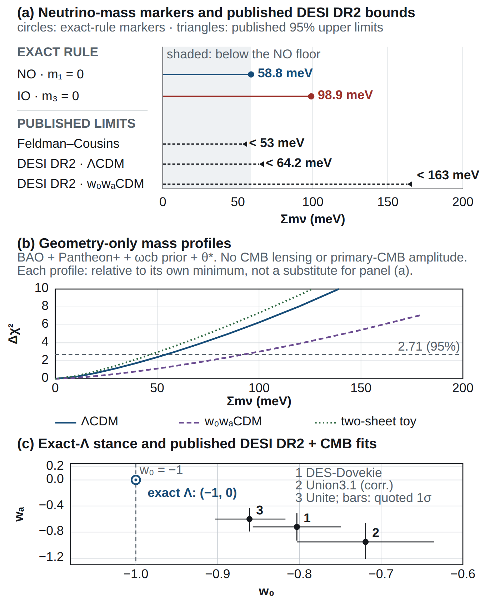

# The Far Side of the Horizon: a geometric fold for CPT-related copies of spacetime

**B. H. Wiseman**

*Independent researcher, Sydney, Australia*

*gr-qc (primary); astro-ph.CO, hep-th (cross-list).*

---

## Abstract

We propose a geometric restriction of the Schwinger-Keldysh closed time path for CPT-symmetric cosmology. The average/difference algebra is standard; the added hypothesis fixes the second leg as the image of the first under a spacetime involution. On de Sitter, the fold $\alpha=J\circ P_\perp$ agrees with the symmetric thermal contour on the central worldline and adds a transverse parity away from it. For free linearised gravity, its antiunitary lift descends through the demonstrated group-averaging construction to a nonzero physical sector. We test specified one-copy states and responses: a nonzero constant image amplitude in the stated conformal-scalar ansatz cannot satisfy both positivity and Hadamard regularity, the stated entropy-temperature pairing fails the first law, and a complete reciprocal time-symmetric response predicts zero binary damping. These tests do not exclude every quotient theory. We also compute the overlap of expanding and contracting branches. In a closed de Sitter example it falls to $e^{-1}$ after a time of order $H^{-1}$. For cosmology we separately adopt Boyle, Finn and Turok's radiation history, particle content, state and stabilising rule; the fold does not derive these inputs. In the stated seesaw approximation, exact stabilisation leaves one light neutrino massless and gives $\Sigma m_\nu=58.8$ meV in normal ordering. Matching the observed dark-matter abundance in their small-Weyl-coupling branch gives a heavy-mass scale of approximately 480 PeV. A weakly broken matter rule can permit decay with a hard neutrino energy near 240 PeV; the lifetime is a free input and the observed spectrum requires electroweak radiation and propagation. The minimal implementation retains exact $\Lambda$ and ordinary absorbing black-hole horizons. Its null tests constrain that implementation, while the matter-rule and interacting-constraint completions remain open.

## 1. Introduction

A horizon hides part of spacetime from an observer. This paper asks whether its hidden partner can be identified with the same physical theory under CPT: charge conjugation, spatial reflection and reversal of time orientation. We retain both copies and relate their fields by an antilinear map, which also conjugates complex numbers. An observer on either side has an ordinary local arrow of time.

The average and difference below are the standard Keldysh variables. Our question is whether their opposite-algebra pairing admits the stated geometric realisation and remains compatible with the free gravitational constraints. Write the two fields as $\Phi$ and $\Theta\Phi$, where $\Theta$ is the antilinear lift of the geometric map, and define

$$
\Phi_c=\frac{\Phi+\Theta\Phi}{2},\qquad
\Phi_q=\Phi-\Theta\Phi.
$$

In the demonstrated free-field construction,

$$
[\Phi_c,\Phi_c]=[\Phi_q,\Phi_q]=0,\qquad
[\Phi_c,\Phi_q]=i\Delta,
$$

where $\Delta$ is the causal commutator kernel. These commutators are the standard left/right closed-time-path algebra. The added hypothesis fixes how the two legs are related globally: by the spacetime involution and its antilinear lift. The average has a classical Gaussian distribution, but the average and difference together remain a quantum system. Keeping both retains the conjugate information that a projection onto the average alone would discard.

For free linearised gravity on de Sitter, the antilinear map also descends on an explicitly constructed nonzero group-averaged sector after the gravitational constraints are imposed. This establishes a bounded compatibility result; the commuting marginal alone does not derive a classical gravitational dynamics. The ordinary graviton commutator is preserved. Positivity on the whole finite-particle space, the interacting constraints and the joint matter-plus-apparatus sector need further construction.

The time directions can also be compared quantitatively. A real no-boundary wavefunction contains expanding and contracting branches. Their matter states become less alike as the universe expands, and we calculate their overlap. With one minimally coupled scalar on closed de Sitter, the overlap reaches $e^{-1}$ when the scale factor is about twice its throat value, after a time of order $H^{-1}$. This defines a decoherence threshold, rather than a discontinuous birth of time. A separate calculation at a radiation bang relates a phase-averaged overlap to the number of produced massive particles. The two calculations use different backgrounds and have different physical clocks.

The cosmological application adds independently specified commitments that can be tested. We adopt Boyle, Finn and Turok's particle content, state-selection prescription and sterile-species stabilising rule [26,34]. If that rule is exact, the chosen sterile neutrino cannot decay and one light neutrino is massless in the stated seesaw approximation. In normal ordering, the oscillation inputs used here give a mass sum of 58.8 meV. In the adopted small-Weyl-coupling branch, the dark-matter abundance fixes the heavy mass at 484.8 PeV. A small added Yukawa column supplies a concrete weakly broken example with a hard two-body neutrino energy near half that mass. Its lifetime and flavor direction are additional inputs. Section 5.2 checks that the induced light-neutrino mass and abundance change can be negligible, and distinguishes this kinematic scale from an observable spectrum. The KM3NeT event is observational context, not evidence for this particle [79].

The numerical commitments below have different inferential roles. In the exact-stabilisation sector, a massless light neutrino and the measured oscillation splittings give the 58.8 meV normal-ordering sum without fitting to an absolute-mass measurement. The 484.8 PeV heavy mass is instead inferred by matching the observed dark-matter abundance in the adopted BFT state and branch. The 242.4 PeV line is a kinematic consequence conditional on that inferred mass, a specified decay channel and a weak violation of the stabilising rule. The null commitments belong to the specified minimal implementation. Section 5 lists the origin, inputs and possible falsifier for each result; none is presented as assumption-free.

The partner is not reached by following the CPT map as a trajectory. The black-hole implementation retains the non-traversable geometry and supplies no interaction that opens a route between the exteriors. It therefore supplies no route for a visitor to arrive in our past. Sarah Connor can relax.

The cosmological CPT model and its dark-matter mechanism belong to Boyle, Finn and Turok [25–26,34]. Thermofield dynamics, the closed time path and its average/difference algebra are established constructions [15–16,71–74]. The contribution developed here is the stated geometric restriction on the two legs, its demonstrated compatibility with a nonzero physical free-graviton sector, the calculated branch overlaps, and tests of specified alternative states and responses. The dependency is not fold $\Rightarrow$ BFT cosmology: the latter supplies separate inputs to the applications in §§4.2 and 5. The calculations distinguish a consistent implementation from several failed choices without claiming to exclude every quotient theory.

The same notation appears in different physical settings. The table states which setting supplies each result. A quotient comparison or Euclidean boundary condition does not automatically change the topology of the defended Lorentzian cover.

| Result and status | Setting and assumptions | What follows |
|---|---|---|
| **Quantum algebra: STANDARD CTP, reproduced here** | A time-orientable cover, its time-reversing involution, and an antilinear lift; paired patch fields with the stated causal support | The even and odd sectors commute separately and have a nonzero cross-commutator. The fixed real algebra retains the quantum theory. |
| **Physical graviton map: PROVEN on one free sector** | The standard global temporal-gauge TT representation, the stated two-graviton seed and its group-orbit domain | The antilinear map descends to a nonzero one-dimensional rigged quotient. Positivity on the whole finite-particle space, the interacting constraints and the joint apparatus sector are not established. |
| **Image-state test: PROVEN for the stated ansatz** | The de Sitter-invariant conformal-scalar image ansatz, standard commutator and Hadamard normalization | Positivity and short-distance regularity force the constant image amplitude to vanish. This is not a no-go for every smooth state-dependent correlation. |
| **Dissipation test: PROVEN for the specified complete response** | A stationary reciprocal binary response equal to the half-retarded plus half-advanced kernel, with the stated temporal boundary conditions and no independent drive | Total secular dissipative work vanishes. Pulsar damping excludes this response choice. Quotient symmetry alone does not select it. |
| **Horizon test: CONDITIONAL implementation** | Ordinary absorbing Kerr perturbation dynamics with no added seam interaction | No additional horizon reflection or fold-induced shift of the Kerr spectrum at the order treated. A dynamical selector for a general seam has not been derived. |
| **De Sitter clock: PROVEN overlap calculation** | Closed de Sitter, the no-boundary branch states and the specified free nonconformal environment | The exact mode sum sets a threshold of order $H^{-1}$. Its numerical value depends on the environment and the chosen overlap threshold. |
| **Radiation-bang clock: CONDITIONAL calculation** | The adopted radiation background, BFT particle state, massive sterile sector and the stated phase averaging and counting convention | The averaged overlap exponent is proportional to the produced particle number. This is a separate clock from the de Sitter throat. |
| **Neutrino and dark-matter values: CONDITIONAL cosmological application** | BFT state selection, radiation history, the chosen mass branch and sterile-species rule; normal ordering where specified | The abundance fixes the heavy mass. Exact stabilisation gives a rank-deficient light-neutrino mass matrix in the stated approximation. A decay line additionally needs rule violation and a specified channel. |
| **$RP^3$ and $RP^4$ comparisons: CONDITIONAL global choices** | A specified spatial quotient or imposed Euclidean boundary data | Harmonic selection and global invariants can change. Their transfer to a physical cover requires a separate continuation argument. |
| **Universal horizon picture: READING** | Extension of the displayed constructions to horizons beyond the exact settings treated | A proposed common interpretation. No general dynamical-horizon theorem is asserted. |

{width=100%}

*Graphical abstract: CPT-related branches and the retained quantum algebra. The widening lobes illustrate the adopted CPT-symmetric cosmological interpretation; each local future points away from the central boundary, and the charge-conjugate, parity-reflected symbols imply no transport of matter between branches. The central panel states the demonstrated algebra for the specified causally disjoint free-field pairing. It marks an algebraic relation, not a physical layer containing gravity. The physical free-graviton construction uses de Sitter space. The horizon symbols illustrate orientation only: relative to one fixed future, the time-reversed portrait is white-hole oriented, while each branch's observer still uses a future-absorbing horizon. The minimal black-hole implementation retains ordinary absorbing Kerr dynamics. No observable white-hole population, black-to-white transition or traversable connection is predicted.*

## 2. CPT-related copies and the quantum algebra

The physical question is whether the hidden partner is removed by a linear
identification or retained through an antilinear relation. The distinction is
algebraic and testable: a linear projection keeps one commuting sector, while
the antilinear construction keeps that sector and its conjugate.

### 2.1 Geometry and the two readings

Let $\alpha$ be the free antipodal involution of the de Sitter cover. It is a
geometric map, distinct from the modular conjugation $J$ of a static-patch
vacuum algebra. Sewell's theorem [7] and the de Sitter analysis of Borchers and
Buchholz [8] identify $J$ with wedge reflection. In the mode convention used
here, $\alpha=J\circ P_\perp$, where
$P_\perp Y_{\ell m}=(-1)^\ell Y_{\ell m}$.

The one-copy comparator takes spacetime to be the quotient and implements
$\alpha$ linearly on fields. The construction defended here retains the
time-orientable cover and equips its field algebra with an antilinear lift
$\Theta$ satisfying

$$
\Theta i\Theta^{-1}=-i,
\qquad
\Theta\phi(f)\Theta^{-1}=\phi(f\circ\alpha).
$$

No trajectory through spacetime is implied by this relation. The two readings
also need not have the same admissible states, global observables or response
law. The tests in Section 3 therefore name the state or response they test.

### 2.2 The closed-time-path interpretation

The doubled algebra itself is standard. For left and right multiplication,
$L_A X=AX$ and $R_A X=XA$, one has
$[L_A,L_B]=L_{[A,B]}$, $[R_A,R_B]=-R_{[A,B]}$ and
$[L_A,R_B]=0$. For free fields with a central commutator, these identities
give exactly the average/difference algebra in §2.3. The additional
construction specifies the spacetime involution, its state implementation and
its compatibility with the gravitational constraints.

The two fields therefore have the algebraic roles of the forward and backward
legs of the Schwinger-Keldysh closed time path [71–72]. With the averaged and
difference variables defined below, the action weight is

$$
\exp\!\left\{i\left[
S\!\left(\Phi_c+\frac{\Phi_q}{2}\right)
-S\!\left(\Phi_c-\frac{\Phi_q}{2}\right)
\right]\right\}.
$$

The relative sign follows from exchanging the legs while conjugating $i$.
In the thermal construction the legs may be displaced by half the KMS period,
as in the symmetric contour of Niemi and Semenoff [73] and Herzog and Son
[74]. In the stated de Sitter quasifree state, the geometric and contour
cross-leg kernels are

$$
G_{12}^{\rm fold}(x,y)=W(x,\alpha y),\qquad
G_{12}^{\beta/2}(x,y)=W(x,Jy),\qquad
\alpha=J\circ P_\perp.
$$

On the central worldline $P_\perp$ acts trivially, so the two kernels agree.
Away from it, the fold supplies a transverse parity, or $(-1)^\ell$ mode by
mode. A closed-time-path calculation can incorporate that twist; the claim is
that the stated geometry supplies it, not that it lies outside the formalism.
Appendix A.6 gives an explicit conformal-scalar control in which
$Z_\alpha-Z_J=-2r^2$.

This dictionary fixes the free two-patch sign and the variables used below.
It does not establish a nonlinear measure, a general interacting state or a
probability for choosing a sheet.

The algebraic correspondence also does not identify expectation prescriptions
without their state, ordering and boundary data. The Gaussian marginal below
is an expectation in the positive cover state. An unshifted trace contour and
a symmetric thermal contour retain their own boundary conditions.

### 2.3 The fixed real algebra

Let real test functions $f$ and $g$ have support in one static patch, with its
antipodal partner causally disjoint, so that $\Delta(f,g\circ\mathcal A)=0$.
For the corresponding paired fields, define

$$
\Phi_c=\frac{\Phi+\Theta\Phi}{2},\qquad
\Phi_q=\Phi-\Theta\Phi.
$$

Time reversal changes the sign of the causal kernel, while antilinearity
changes the sign of $i$. The same-sheet commutators have opposite signs and
the cross-sheet commutators vanish in the stated patch pairing. Hence

$$
[\Phi_c,\Phi_c]=[\Phi_q,\Phi_q]=0,
\qquad
[\Phi_c,\Phi_q]=i\Delta.
$$

The $\Theta$-fixed real algebra is generated by the even fields $\Phi_c$ and
by $i\Phi_q$. Their mutual commutator is nonzero. Its complexification
reconstructs the generated quantum algebra, whereas projection onto $\Phi_c$
alone discards the conjugate sector. This statement concerns the identified
global algebra. It does not imply that every local algebra on every quotient
spacetime is classical.

With this normalization, the even covariance is

$$
\langle\Phi_c\Phi_c\rangle
=\frac{G_{\rm sym}+G_{\rm img}}{2}.
$$

The commuting even sector has a Gaussian probability distribution given by
the Bunch-Davies vacuum marginal in this polarization. A covariance is not a
probability density, and this marginal alone is not a complete classical
dynamical theory. Section 4 supplies the separate branch-overlap calculation
used to discuss physical classicality.

The claim of unchanged local dynamics also has explicit premises. On a common
globally hyperbolic, causally convex patch, assume the same locally covariant
time ordering and renormalization prescription, compactly supported
interactions and insertions, and equality of the full smooth restricted
two-point function. Under those assumptions, naturality makes the relative
$S$-matrices and Bogoliubov maps agree coefficient by coefficient [9–10].
Equality of Hadamard singularities alone is insufficient. Global state
preparation, noncompact support, gauge and edge sectors, and sums over saddles
remain outside this local statement.

### 2.4 A nonzero group-averaged free-graviton sector

For group averaging we use the standard global, temporal-gauge radiative TT
Fock representation employed by Marolf and Morrison [61]. Its one-particle
norm, invariant vacuum and compensated de Sitter action are imported together.
Gerard and Wrochna [62] separately construct a positive $O(4)$-invariant
Hadamard state whose modified covariance is not invariant under the full de
Sitter group. We do not identify that state with the representation used
below.

The geometric lift can be checked directly in the global representation.
Choose real spatial TT harmonics $T_{nA}$, $n\geq3$, whose spatial antipodal
parity on either TT type is $s_n=(-1)^{n+1}$. For future-increasing conformal
time and the positive Klein-Gordon convention, the canonically rescaled
positive-frequency mode may be written

$$
u_n(\eta)=\frac{e^{-in\eta}(\tan\eta-in)}
{\sqrt{2n(n^2-1)}},
\qquad u_n(-\eta)=-\overline{u_n(\eta)}.
$$

It obeys
$i(\overline u_nu_n'-u_n\overline u_n')=1$. An even scale factor converts
back to the metric field without changing the reflection identity.

On one-particle coefficients define

$$
(\Theta_1c)_{nA}=(-1)^n\overline{c_{nA}}.
$$

This is an antiunitary involution. Its bosonic Fock lift fixes the vacuum,
sends $a^\dagger_{nA}$ to $(-1)^na^\dagger_{nA}$ and
implements $\Theta h(p)\Theta^{-1}=h(\alpha p)$, with tensor pullback
understood. Temporal gauge and the TT conditions are preserved, and an
isometry maps pure-gauge perturbations to pure-gauge perturbations, so the map
is well defined on the reduced classes. Since the antipode is central, the
lift and the compensated de Sitter action implement the same automorphism of
the irreducibly represented reduced CCR algebra. Their scalar ambiguity is
fixed to one by the common invariant vacuum. Hence

$$
\Theta U(g)\Theta^{-1}=U(g).
$$

The $O(4)$-invariant two-graviton seed
$\Psi=\sum_{A=1}^{10}(a^\dagger_{3A})^2|0\rangle$ is the unique parity-even
quadratic creation-operator singlet in the real $n=3$ transverse-traceless
basis. It has $\|\Psi\|^2=20$ and $\Theta\Psi=\Psi$. It is not already physical.
The six rotation charges annihilate it, while the four boost charges obey

$$
\sum_{a=1}^{4}\|Q_a\Psi\|^2=240,
\qquad \|\Psi\|^2=20.
$$

The full $SO_0(1,4)$ average is therefore required. In the spin-2 boost chain,
the adjacent-level coefficient is
$b_n=\tfrac12\sqrt{(n+3)(n-2)}$. The bottom matrix coefficient is
$d(\lambda)=\operatorname{sech}^6(\lambda/2)$. The $KAK$ decomposition
and $O(4)$ invariance give
$\langle\Psi,U(k_1b(\lambda)k_2)\Psi\rangle
=20\operatorname{sech}^{12}(\lambda/2)$, so the integral reduces to one
rapidity variable. With the
Haar factor used by Marolf and Morrison [61],

$$
\langle\Psi,\eta(\Psi)\rangle
=\|\Psi\|^2\int_0^\infty
\sinh^3\lambda\,\operatorname{sech}^{12}(\lambda/2)\,d\lambda
=20\left(\frac23\right)=\frac{40}{3}.
$$

The substitution $u=\tanh(\lambda/2)$ gives
$16\int_0^1u^3(1-u^2)^2du=2/3$.

The matrix coefficient is integrable, but convergence alone does not prove
positivity on an unspecified finite-particle domain. We therefore use the
explicit cyclic domain

$$
\mathcal D_\Psi=\operatorname{span}_{\rm alg}
\{U(g)\Psi:g\in SO_0(1,4)\}.
$$

For $v=\sum_i c_iU(g_i)\Psi$ and $w=\sum_j d_jU(h_j)\Psi$, invariance of Haar
measure gives the group-averaging form

$$
B(v,w)=\int_{SO_0(1,4)}dg\,\langle v,U(g)w\rangle
=\frac{40}{3}\,\overline{\sum_i c_i}\sum_j d_j.
$$

Thus $B$ is positive semidefinite on the whole stated domain, its null space
is $\sum_i c_i=0$, and its completed quotient is one-dimensional with
$B(\Psi,\Psi)=40/3$. The formula is independent of the chosen finite orbit
expansion: if $\sum_i c_iU(g_i)\Psi=0$, pairing that relation with $\Psi$
under the same absolutely convergent average gives $\sum_i c_i=0$. Because
$\Theta\Psi=\Psi$ and $\Theta$ commutes with
$U(g)$, $\mathcal D_\Psi$ is $\Theta$-stable and
$B(\Theta v,\Theta w)=\overline{B(v,w)}$. The lift descends to conjugation on
this nonzero physical sector. This is the fold-specific compatibility result.
It neither establishes positivity on the full finite-particle space, changes
the Keldysh algebra nor constructs an interacting gravitational theory.

The reduced free transverse-traceless algebra retains its ordinary graviton
commutator. The standard weak-field
quantum-mediation calculation, including the Bose-Marletto-Vedral proposal,
therefore remains available [68]. This result does not select a unique graviton
vacuum: fold covariance leaves a curve in each Bogoliubov disc, while the
Euclidean cap supplies the additional state choice. Nor does it complete the
interacting gravitational constraints or the relational apparatus sector.

### 2.5 Complete histories and the return charge

Linearisation stability on a closed spatial slice requires the de Sitter
charges of a complete perturbation to vanish. For a fold-invariant complete
stress history, the antipode reverses the future cover normal, so

$$
Q_\xi(-t)=-Q_\xi(t).
$$

Stress-tensor conservation and Stokes' theorem give the second relation
$Q_\xi(-t)=Q_\xi(t)$. All ten cover charges therefore vanish. In this limited
sense, the image supplies the return required by the complete-history
constraint.

The restriction is essential. The antipode maps $(t,\mathbf n)$ to
$(-t,-\mathbf n)$, so the image lies on the same slice only at $t=0$. A finite
branch preparation still needs an apparatus Ward flux. The joint
matter-plus-gravity rigged norm and the relational laboratory observable are
open. The result balances a complete history; it does not remove the apparatus
from a finite experiment.

## 3. Tests of states and responses

Each test below has a named ansatz or response law. A failure constrains that
choice. It is not promoted to a theorem about every possible quotient.

### 3.1 The constant image-state ansatz

For the de Sitter-invariant conformally coupled scalar ansatz

$$
W=\tfrac12 i\Delta+A\,G_{\rm sym}(Z)+B\,G(-Z),
$$

positivity requires $A\geq1$ and $A^2-B^2\geq1$. Hadamard normalization at coincidence
requires $A=1$, and therefore $B=0$. A nonzero constant image amplitude cannot
satisfy both conditions. Positive image states outside the Hadamard class,
including the alpha-vacuum family, are not excluded by positivity alone [70].
The result also leaves open smooth, state-dependent finite-frequency
correlations outside this two-amplitude ansatz. Appendix A.7 gives the mode
covariance and the two inequalities.

### 3.2 The entropy-temperature pairing

The proposed elliptic pairing $(T_H,\mathcal A/8G)$, where $\mathcal A$ is the
cover horizon area, fails the Smarr relation $M=2TS$ and the first law
$dM=T\,dS$ [3--5]. For example, in Schwarzschild units $G=M=1$,
$T_H=1/(8\pi)$ and $\mathcal A=16\pi$: the proposed pair gives $2TS=1/2$
and $T_Hd(\mathcal A/8G)=dM/2$. The two-copy pairing
$(T_H,\mathcal A/4G)$ and 't Hooft's pairing
$(2T_H,\mathcal A/8G)$ both give $2TS=M$ and the correct first law. The quotient two-point function used in the
comparison has imaginary period $\pi R$ at the central worldline, so its even
sector realizes the latter temperature. Away from the centre, all harmonics
contribute and no single temperature describes the response. Thermodynamics
therefore rejects the stated temperature-entropy assignment, not the quotient
geometry itself.

### 3.3 The complete reciprocal time-symmetric response

The antipode reverses time orientation and exchanges the retarded and advanced kernels. Within the affine family $\alpha G_{\rm ret}+(1-\alpha)G_{\rm adv}$, invariance selects

$$
G_{\rm sym}=\frac{G_{\rm ret}+G_{\rm adv}}{2}.
$$

For the stationary reciprocal problem considered here, this kernel is Hermitian. With a complete steady-state cycle, or vanishing all-history boundary terms, integration by parts gives zero total dissipative work. If this kernel is the binary's complete effective gravitational response, with no independent homogeneous drive or environmental contribution, the binary has no secular radiation damping. The observed orbital decay of PSR B1913+16 excludes that response: Weisberg and Huang report an observed-to-GR ratio of $0.9983\pm0.0016$ [67].

Quotient descent does not fix the complete response. An invariant homogeneous solution can change a lifted field without changing its source equation. Nor does antipodal parity imply local time parity: on $\mathbb R\times S^1$ with $A(t,\theta)=(-t,\theta+\pi)$, the homogeneous wave $h=\sin t\cos\theta$ is A-even, while $\partial_t h=\cos t\cos\theta$ is even in time at fixed position. A suitable local source can exchange work with this wave, with cancellation in the antipodal region. This scalar counterexample defeats the symmetry inference; it does not compute a gravitational self-force.

A twisted Green kernel is odd under the antipode in each argument and even under its simultaneous action on both arguments. Its identity distribution is the twisted delta. There is no contradiction of the form $\delta=-\delta$.

The surviving observational test is exact within its premises: a complete reciprocal time-symmetric response has no secular dissipative work and fails the pulsar measurement. A more general quotient response requires its own boundary and source problem. Friedman and Higuchi's locally defined quotient theory makes the distinction between local physics and global identification explicit [10].

### 3.4 The minimal black-hole response

For black holes, the minimal implementation retains ordinary Kerr perturbation dynamics and the absorbing horizon boundary condition. We add no seam interaction. At the order treated, it therefore predicts no additional horizon reflectivity and no fold-induced shift of the Kerr quasinormal spectrum.

The boundary condition is a physical commitment of this implementation. Flux conservation and covariance under the fold do not select it: the allowed seam matrices include a continuous range of reflectivities. A dynamical matching law for a general rotating-horizon seam remains unconstructed here. A proposed seam with nonzero reflection must supply that law before its waveform can be compared with the data.

The published near-horizon scattering model of Betzios, Gaddam and Papadoulaki provides a concrete alternative [77]. Its small corrections are compatible with present echo bounds, so null searches do not yet distinguish the two implementations. Reflection alone also does not imply a resonance pole; a prompt constant reflection coefficient is a simple counterexample.

LVK's GWTC-3 analysis reports a damping-time deviation $\delta\hat\tau_{220}=0.14^{+0.11}_{-0.11}$ when multiplying posteriors and $0.13^{+0.21}_{-0.22}$ under hierarchical combination [78]. These are 90% credible intervals. The first excludes zero; the second includes it. The analysis discusses positive bias and possible prior effects, and does not claim a violation of GR. We do not convert the quoted interval width into a one-standard-deviation error.

A robust intrinsic departure from the predicted Kerr response, after the relevant astrophysical and waveform effects are accounted for, would challenge the adopted minimal implementation. It would not identify reflection as the cause or prove a particular quotient geometry. Echo-like propagation effects must likewise be distinguished from a new horizon reflection law.

## 4. When the time directions lose coherence

The real Hartle-Hawking wavefunction contains expanding and contracting WKB
branches [66]. Inhomogeneous modes can decohere them, as in the work of
Halliwell, Hawking and Kiefer [63–65]. Here the two branches are compared by an
explicit overlap. The closed-de Sitter throat and the radiation bang are
different calculations and use different clocks.

The closed-de Sitter calculation uses standard no-boundary branch states and
does not require BFT's matter model. Identifying those branches with the
proposed CPT-related copies is an additional interpretation; the overlap does
not establish that identification.

### 4.1 A closed-de Sitter overlap

Closed FRW minisuperspace with $\Lambda=3H^2$ has a classically allowed region
beginning at the no-boundary throat $aH=1$. For $N_f$ minimally coupled
massless scalar fields, the exact mode function gives

$$
\Omega_n=
\frac{n(n^2-1)-i\tan\eta\,\sec^2\eta}{\tan^2\eta+n^2},
\qquad
\operatorname{Im}\Omega_n=
-\frac{\dot a\,(aH)^2}{\dot a^2+n^2}.
$$

The two branches carry complex-conjugate Gaussian environment states. With
$A\equiv aH$, their overlap is

$$
\log|\langle E_-|E_+\rangle|
=-\frac{N_f}{4}\sum_{n\ge2}n^2
\log\!\left[
1+\frac{A^4(A^2-1)}{n^2(n^2-1)^2}
\right],
$$

with large-$A$ asymptote
$-(\pi/12)N_fA^3$. Appendix A.8 derives the sum. For one minimally
coupled scalar, the overlap reaches $e^{-1}$ at

$$
aH=1.95376,\qquad Ht=1.28984.
$$

The exponent contains no explicit $\hbar$ or $G$; the background Hubble rate
sets the time scale. The threshold is a declared measure of decoherence, not a
discontinuous creation of time or a rule selecting one branch. Conformally
coupled free fields have real widths in this calculation and do not contribute
to the separation. The result changes with the environment and with the
chosen overlap threshold.

The $RP^3$ harmonic restriction is a separate topology-dependent comparison.
It changes the mode sum, but the defended Lorentzian cover does not acquire
that restriction merely because its fields carry an antilinear CPT relation.
The numerical comparison is given in the supplement.

### 4.2 A radiation-bang overlap

At a radiation bang, $R=0$ and $a''=0$. Massless free fields are conformal in
this background, while a mass term can distinguish the two orientations. In
the adopted BFT massive-particle state [26,34], use the dimensionless momentum

Here $p$ is comoving momentum, $a(\eta)=a_1\eta$, and

$$
x=\frac{\sqrt{\pi}\,p}{\sqrt{\gamma}},\qquad
n(x)=\frac{1-\sqrt{1-e^{-x^2}}}{2},\qquad \gamma=M_1a_1,
$$

$$
R=\frac{\int_0^\infty x^2[-\log(1-n(x))]\,dx}
        {\int_0^\infty x^2n(x)\,dx}=1.07037,
\qquad
I=\frac{1}{\pi^2}\int_0^\infty x^2n(x)\,dx=0.0127597.
$$

The occupation function and production integral $I$ come from BFT. Here they
are used to calculate the phase-averaged overlap and the new ratio $R$ to the
produced-particle number.

For one produced pair,

$$
|D_k|^2=1-4n_k(1-n_k)\sin^2\phi_k,
\qquad
-\langle\log|D_k|\rangle_{\phi_k}=-\log(1-n_k),
$$

for $n_k\leq1/2$. Thus $\overline\Gamma=-\sum_k\log(1-n_k)=RN$, and in a
Hubble volume

$$
\overline\Gamma_H=\frac{4}{3\sqrt\pi}\,c_GRI
\left(\frac{M_1}{H}\right)^{3/2}.
$$

The phase-averaged crossing time is

$$
t_{\rm dec}=\frac{1}{2M_1}
\left(\frac{4}{3\sqrt\pi}\,c_GRI\right)^{-2/3}.
$$

Here $N$ is the produced-particle count and $c_G$ is its mode-counting factor.
The threshold $\overline\Gamma=1$ is reached when a
Hubble volume contains a particle count of order unity. With the adopted mass
and $c_G=1$ per $(p,h)$ mode, the crossing is
$1.44\times10^{-32}$ s. Counting a Majorana pair with $c_G=1/2$ instead gives
$2.28\times10^{-32}$ s. This factor-of-order-one convention is not a physical
precision claim.

The unaveraged exponent oscillates rather than saturates. This number is
therefore a phase-averaged comparison, not a proof of irreversible branch
selection. It is separate from the closed-de Sitter $H^{-1}$ threshold above.

## 5. Conditional cosmology and observational tests

This section adopts BFT's cosmology for comparison with observations. Its
radiation history, production state, particle content and stabilising rule are
additional inputs; the geometric construction in §2 does not derive them. We
reproduce the abundance calculation and update the neutrino values from
oscillation data. The conditional decay line and contact benchmark require
further channel and coupling assumptions. Exact $\Lambda$ and ordinary Kerr
absorption are separate commitments of the minimal implementation.

### 5.1 State selection and abundance

The mode problem used for the gravitational-production calculation is a
Landau-Zener crossing at the bang. In the adopted BFT state, the reproduced
integral is

$$
I\simeq0.01276,
$$

and the small-Weyl-coupling abundance branch gives

$$
M_1=4.848\times10^8\ {\rm GeV}.
$$

The displayed mass is a computational benchmark obtained by treating the listed
inputs as exact. The reconstruction uses $\rho_{\rm DM,0}=9.7\times10^{-48}$
GeV$^4$, $s_0=2.3\times10^{-38}$ GeV$^3$, $\widehat\mu=5.966\times10^{18}$ GeV
and $g_*=106.75$. Their input and model uncertainties have not been propagated,
so the extra digits in 484.8 PeV and its 242.4 PeV half-mass do not denote
four-digit physical accuracy. The physical scales are approximately 480 PeV
and 240 PeV. The companion retains $I=0.0127596673634$ as a quadrature check
for the fixed occupation function.

The scaling $M_1\propto I^{-2/5}$ makes the dependence on the production
integral explicit. The state and the radiation history remain inputs, and a
different state or the separate large-Weyl-coupling branch changes the mass.

#### Ultraviolet condition and finite-momentum freedom

The Hadamard condition fixes the short-distance structure of the state. In the seed convention used here, its leading large-momentum requirement is

$$
\frac{c_+(0)}{c_-(0)}\sim\frac{i\gamma}{4p^2},\qquad \gamma=ma_1,
$$

with higher terms fixed by the adiabatic expansion. The tested bang-adiabatic state misses this requirement and has an occupation tail proportional to $p^{-4}$, producing a logarithmically divergent energy integral. This excludes that state under the stated ultraviolet criterion.

CPT symmetry and the Hadamard condition still permit finite-momentum state freedom. A smooth change confined to a finite momentum band can preserve both the symmetry and every ultraviolet asymptotic coefficient. The explicit CPT-invariant families of Nadal-Gisbert, Navarro-Salas and Pla exhibit this freedom [80]. We therefore retain BFT's additional minimum-energy prescription to choose the state used in the abundance calculation [26,34]. In that state the production integral reproduces their result. The ultraviolet test strengthens the case against the particular sudden-start alternative; it does not select a unique member of the entire CPT-invariant Hadamard family.

### 5.2 Matter rule, neutrino masses and the conditional line

We use BFT's gravitational-production state and radiation history [26,34]. In the adopted small-Weyl-coupling branch, matching the observed dark-matter abundance gives $M_1=4.848\times10^8$ GeV. This number is conditional on that production model and state selection.

The sterile-species $\mathbb Z_2$ is an additional matter-theory assumption. The quotient admits a nontrivial sign bundle, but the bundle pulls back trivially to the simply connected physical cover. We have not constructed a continuation from the Euclidean boundary data to an interacting cover action and measure that enforce the same species rule. The phenomenology therefore retains BFT's imposed stabilisation rule.

When that rule is exact, the sterile particle cannot decay. Its forbidden Yukawa column makes the light-neutrino mass matrix rank at most two in the stated seesaw approximation. The two measured oscillation splittings then leave one light neutrino massless. For normal ordering and the oscillation inputs used here, $\Sigma m_\nu=58.78^{+0.24}_{-0.22}$ meV, with the independent input errors propagated at first order. The ordering is specified separately; exact stabilisation alone does not choose it.

The double-beta interval in §5.5 spans the remaining unknown Majorana phase. The construction does not select a point within that interval.

A concrete weakly broken implementation adds a small gauge-invariant Yukawa column $-y_\alpha\overline L_\alpha\widetilde H N_{1R}+{\rm h.c.}$, with the other two sterile neutrinos heavier and no other open $N_1$ decay channel. This is an additional matter interaction, not a consequence of the fold. Write $q=y^\dagger y$ and $H^0=(v+h+iG^0)/\sqrt2$, with $v=246.22$ GeV. At tree level and $M_1\gg m_W,m_Z,m_h$ [81],

$$
\Gamma_0=\frac{qM_1}{8\pi},\qquad
{\rm Br}(h\nu):{\rm Br}(Z\nu):{\rm Br}(W\ell)=1:1:2,
$$

where the charged channel includes both charges. A pure Higgs-neutrino branching assignment is therefore unavailable in this example. The same column adds $\delta m_\nu=-v^2yy^T/(2M_1)$. Relative to the rank-two tree-level baseline, its smallest mass obeys

$$
m_{\min}\leq\|\delta m_\nu\|_2
=\frac{4\pi v^2\hbar}{M_1^2\tau},\qquad \tau=\hbar/\Gamma_0.
$$

For the freely chosen example $\tau=10^{28}$ s, $\|y\|\simeq1.8\times10^{-30}$ and the bound is about $2.1\times10^{-55}$ eV. This bounds the added tree-level mass term; radiative masses of the baseline are a separate question. With the adopted radiation history and only this new interaction, the inverse-decay population and the decay depletion are negligible at the accuracy of the abundance benchmark (Supplement S13). Thus a long-lived decay need not spoil the abundance or the effectively massless light-neutrino result, although exact stabilisation and a nonzero decay cannot hold simultaneously.

For a cold parent at rest, the neutral hard channels have

$$
E_{\nu,b}=\frac{M_1^2-m_b^2}{2M_1}\simeq\frac{M_1}{2},\qquad b=h,Z.
$$

They both round to 242.4 PeV for the computational mass benchmark, a physical scale of roughly 240 PeV. Electroweak radiation and boson decay produce a continuum and change the endpoint weight at this energy [82]. Halo velocities, extragalactic redshift, propagation and detector response must also be included to predict a measured spectrum. Neither that spectrum nor an event rate is calculated here. KM3NeT's broad reconstructed event-energy interval [79] is not evidence for this decay assignment; no likelihood preference over an astrophysical population is claimed.

The distinction is experimentally useful. A spectrum and flux calculated for a specified lifetime and flavor direction can be tested with neutrino and photon observations. A channel exclusion would constrain that implementation, while exact stabilisation predicts no decay signal. Neither observation would by itself establish or reject the entire two-copy geometry.

### 5.3 A contact-rate and scattering benchmark

The direct-detection estimate concerns one heavy-contact benchmark rather than
a derived ultraviolet operator. Its order-of-magnitude effective rates are

$$
\Gamma_{\rm int}\sim\frac{T^5}{\Lambda^4},\qquad
H(T)=1.66\sqrt{g_*}\frac{T^2}{M_{\rm Pl}},\qquad
\sigma_n\sim\frac{m_n^2}{\pi\Lambda^4}.
$$

We take $g_*=106.75$ and the non-reduced Planck mass. If this effective description remains valid at bath temperature $T=M_1$, requiring the interaction rate there to lie below the expansion rate gives $\Lambda\gtrsim9.49\times10^{10}$ GeV and $\sigma_n\lesssim1.35\times10^{-72}$ cm$^2$. The numerical coefficients and form-factor treatment are the conventions of this benchmark, so these are order-of-magnitude estimates, not portal-independent limits. This single-temperature check does not establish nonthermalisation throughout the earlier radiation era. With the stated standard-radiation inputs, the epoch $H=M_1$ has bath temperature about $1.86\times10^{13}$ GeV, where the ultraviolet portal must be specified.

For the isospin-conserving spin-independent contact benchmark, the zero-momentum nuclear cross section is $\sigma_A(0)=A^2(\mu_A/\mu_n)^2\sigma_n$, where $\mu_A$ and $\mu_n$ are the dark-matter reduced masses with the nucleus and nucleon. We count nuclei, not nucleons, in converting flux to events. At $M_1=4.848\times10^8$ GeV, $\sigma_n=10^{-72}$ cm$^2$ and $A=131$, the stated halo inputs give approximately $2.3\times10^{-30}$ events in LZ's 2.84 tonne-year exposure with $F(q)=1$ and unit efficiency. Nuclear form factors, recoil thresholds and efficiencies reduce a physical count. One event at this idealised rate corresponds to about $0.015$ Earth masses of xenon operating for 13.8 billion years at today's assumed halo flux, or $0.011$ Earth masses at the calculated contact ceiling. These are exposure-scale comparisons, not realizable detector designs.

Exact $\mathbb Z_2$ permits other even portals. A recoil incompatible with this contact estimate excludes this implementation of the coupling; it does not automatically exclude the particle, the massless-neutrino result or the two-copy construction.

### 5.4 Exact $\Lambda$ and other null commitments

The null tests belong to the minimal implementation specified here. Their logical status differs. A linear transformation of a Gaussian free state preserves its vanishing connected three-point function. Thus the fold adds no bispectrum in that calculation. A full primordial prediction also requires the interaction terms, initial state and conversion to the observable curvature perturbation. The free-field statement alone does not fix those ingredients.

The local GR equations are unchanged in the sectors demonstrated here. For the same cosmological parameters and initial spectrum, the adopted baseline therefore uses the standard growth and lensing relations. We do not claim that the algebraic construction alone proves an all-scale, all-interactions equality for every structure observable. Any additional correction to the Poisson equation would have to be specified as part of a different effective implementation and included in its growth and lensing predictions.

The present construction supplies no established mechanism to alter the abundance of early galaxies. An observed galaxy population is not by itself a falsifier. Evidence that the initial conditions or growth require physics excluded by the specified minimal cosmology would challenge that cosmology. Passing a test shared with GR or ΛCDM does not uniquely identify the fold.

For dark energy, we adopt an exact cosmological constant. For the restricted
metric-only action class used in the companion derivation,
with expansion scalar $\theta=3H$,

$$
\rho=\theta f'(\theta)-f(\theta),\qquad
\rho+p=-\dot\theta f''(\theta).
$$

The stated off-shell closure conditions leave a constant term plus a boundary
term. For the constant term, $p_\Lambda=-\rho_\Lambda$ even in a decelerating
matter-filled background. The continuity equations then give $Q=0$ and
$\rho_m\propto a^{-3}$. This is a result for that restricted action and
closure problem, not a theorem about every covariant dark-energy theory.

### 5.5 One table of observational commitments

The tests below refer to the stated implementation. Several predictions are inherited from BFT or shared with ordinary GR. Each row names the assumptions that a contrary observation would test.

| Quantity | Prediction and required assumptions | Origin | Observational test and what it excludes |
|---|---|---|---|
| Light-neutrino masses | One massless light neutrino in the exact-stabilisation seesaw approximation. With normal ordering, the inputs used here give $\Sigma m_\nu=58.8$ meV and $m_{\beta\beta}=1.5$–$3.7$ meV. | BFT [26,34]; numerical values from the stated oscillation inputs. | Oscillation measurements test the ordering; cosmology tests the sum conditional on its cosmological model. A larger established absolute mass would exclude this rank-deficient mass sector. Present null double-beta results do not confirm the narrow predicted range. |
| Conditional decay-energy scale | Hard $h\nu$ and $Z\nu$ energies near $M_1/2$, approximately 240 PeV. The weak Yukawa example has $h\nu:Z\nu:W\ell=1:1:2$ at tree level; lifetime and flavor are free. Radiation and propagation determine the observed spectrum. | BFT abundance calibration plus the added Yukawa model and two-body kinematics. | Neutrino and photon spectra test a specified lifetime and flavor direction. No KM3NeT likelihood preference is calculated [79]. A channel exclusion does not exclude exact stabilisation, which predicts no decay signal. |
| Direct-recoil contact benchmark | $\sigma_n\lesssim1.35\times10^{-72}$ cm$^2$ under the adopted contact-rate, scattering and radiation-history assumptions. At the rounded benchmark, LZ's quoted exposure gives about $2.3\times10^{-30}$ events for the stated SI point-nucleus, unit-efficiency benchmark. | This paper's conditional rate-and-scattering benchmark. | A recoil incompatible with this estimate excludes these benchmark assumptions. Other $\mathbb Z_2$-even portals remain allowed. |
| Primordial long-wavelength tensor component | Absent in the adopted BFT bang model without an inflationary epoch; this is the stated primordial component, not every possible source of gravitational waves. | BFT [26,34]. | A securely identified primordial component incompatible with that bang calculation would exclude this cosmological implementation. |
| Intrinsic black-hole horizon response | Ordinary absorbing Kerr dynamics, with no additional horizon reflectivity or fold-induced quasinormal-mode shift at the order treated. | The adopted minimal black-hole implementation. | A robust intrinsic departure from this response would exclude that implementation. Published echo and damping analyses are discussed in §3; a departure would not uniquely identify its cause or a quotient geometry. |
| Dark energy and matter exchange | $\rho_\Lambda$ constant, $p_\Lambda=-\rho_\Lambda$ and $Q=0$ in the adopted minimal cosmology. | The restricted action/closure analysis and the continuity equation. | Expansion and growth data test this exact-Λ cosmology. A robust need for evolving dark energy would exclude that commitment. |
| Growth and lensing | Standard GR baseline for the same matter content, parameters and initial spectrum in the demonstrated regime. | The retained local dynamics. | A robust departure requiring additional interactions or modified gravity would challenge this baseline. No universal all-scale completion is proved by the free algebra alone. |
| Quantum gravitational mediation | The graviton retains its quantum commutator; the ordinary weak-field quantum-mediation calculation remains available. | The free physical-graviton construction and the retained local coupling. | A controlled gravitational-entanglement experiment tests quantum mediation. Agreement would support a prediction shared with ordinary quantum gravity and would not uniquely establish the fold; the relational apparatus completion remains open. |

The linear fold map adds no connected three-point function to the stated Gaussian free state. This is a structural result, not a complete prediction for the observable primordial bispectrum after interactions and conversion to curvature perturbations. Early-galaxy abundances likewise require their astrophysical and initial-condition analysis before they can test the cosmological implementation.

### 5.6 Observational context

**Figure 5: neutrino mass and dark-energy context.** *(a)* The massless-lightest-neutrino markers in the exact stabilising-rule sector at
58.8 meV (normal ordering, $m_1 = 0$) and 98.9 meV (inverted, $m_3 = 0$), against DESI DR2 BAO + CMB bounds
from Elbers et al. (arXiv:2503.14744): 64.2 meV for $\Lambda$CDM, 163 meV for $w_0w_a$CDM, and the 53 meV
Feldman–Cousins limit. The shaded region below 58.8 meV is kinematically forbidden. *(b)* The three $\Delta\chi^2$
curves are a geometry-only reproduction using BAO, Pantheon+, an $\omega_{cb}$ prior and $\theta_*$, with no CMB
lensing or primary-CMB amplitude. They show the relative shape of the three models and are weaker than, not a
substitute for, the published bounds in panel (a). *(c)* The adopted exact-$\Lambda$ commitment
$(w_0, w_a) = (-1, 0)$, against three published fits incorporating DESI DR2 BAO and CMB, with
different supernova samples and quoted $1\sigma$ uncertainties: DES-Dovekie
$(-0.803\pm0.054,-0.72\pm0.21)$ (arXiv:2511.07517), corrected Union3.1
$(-0.719\pm0.084,-0.95^{+0.29}_{-0.26})$ (arXiv:2601.19424), and Unite
$(-0.861^{+0.044}_{-0.042},-0.60^{+0.17}_{-0.19})$ (arXiv:2609.05053; also includes DES BAO),
and the $w_0=-1$ phantom divide.

---

## 6. What is established and what remains

The average/difference commutators are the standard closed-time-path algebra. The added construction fixes a geometric relation between the legs: on de Sitter, $\alpha=J\circ P_\perp$, with an explicit off-axis parity twist. For free linearised gravity on de Sitter, its antilinear lift survives the demonstrated group average on the stated cyclic domain to a nonzero one-dimensional physical quotient. This is a global geometric and constraint-compatibility result within ordinary quantum field theory, not a claim of positivity on the full finite-particle space, a new quantisation rule or an interacting theory of gravity.

The comparison with one-copy constructions has a precise scope. The proposed image state fails the stated short-distance and positivity conditions. The specified temperature-entropy pairing fails the first law. A complete reciprocal time-symmetric response predicts no secular binary damping and fails the pulsar measurement. These results constrain states, thermodynamic assignments and response choices; they do not prove that every quotient theory fails.

The time-direction calculation adds a separate quantitative result. On closed de Sitter, the exact mode sum gives a branch-decoherence threshold of order $H^{-1}$. At a radiation bang, the phase-averaged overlap in the adopted particle state is proportional to the produced massive-particle number. The two results refer to different backgrounds. Neither supplies a route for travelling to the CPT partner.

The observational commitments belong to the stated cosmological implementation. With BFT's state selection and exact sterile-species stabilisation, the seesaw approximation leaves one light neutrino massless and gives $\Sigma m_\nu=58.8$ meV in normal ordering. The observed abundance fixes the heavy-mass benchmark at 484.8 PeV within the adopted production branch. The added weak Yukawa example permits decay while keeping the abundance and induced light-neutrino mass effectively unchanged at the stated accuracy. Its hard neutral-channel energy is roughly half the heavy mass. The lifetime and flavor direction remain free, and radiation and propagation are needed before predicting an observable spectrum.

The minimal implementation also retains an exact cosmological constant and ordinary absorbing black-hole dynamics. A contrary result can refute those commitments. Null results shared with GR and ΛCDM cannot establish the fold as the unique explanation. The contact-portal recoil estimate tests that coupling implementation and does not exclude other $\mathbb Z_2$-even portals.

The remaining mathematical tasks are specific: the interacting constraints, the joint matter-and-apparatus construction, and a cover matter action and measure that enforce the sterile-species rule from the proposed boundary data. A general rotating-horizon seam would require its own matching law. The present results do not require those objects to be silently assumed complete.

The physical content can be stated simply. Keeping the CPT-related copies preserves both a classical field distribution and the conjugate information needed for quantum physics. Separately specified no-boundary and BFT branch states give the overlap calculations in §4. The adopted cosmology then supplies definite, conditional tests. That is the construction to assess and the set of commitments to compare with observation.

## Appendix A, supporting derivations

Pointers are to the companion repository; equations are reproduced so the appendix stands alone.

**A.1 The dark-matter state.** The "in" vacuum's occupation is
$|\beta|^2=e^{-x^2}$, giving
$I_b=\pi^{-2}\int x^2e^{-x^2}dx=1/(4\pi^{3/2})=0.0448968$. Fold-invariance is tested operationally
as the exchange of in- and out-regions. For the bang-adiabatic vacuum the evolution starts at τ = 0,
so first-order adiabatic perturbation theory retains a boundary term: with θ = arctan(*p*/γτ) the
adiabatic coupling is θ′/2, and integration by parts leaves ½·θ′(0)/(2*i*ω(0)) = *i*γ/(4$p^2$), whence
$n_{B}$ → γ²/(16$p^4$). Numerically $n_{B}$/(γ²/16$p^4$) runs 1.114 → 1.0010 at *p*/√γ = 2…6, log-slope
−4.308 → −4.006. A *p*⁻⁴ tail leaves $\int dp\,p^2n(p)$ convergent, while the
relativistic energy measure $\int dp\,p^2\omega_p n(p)\sim\int dp\,p^3n(p)$ is logarithmically
divergent. Recorded limitation: this is the mode-occupation statement, not a covariant point-split
stress tensor.

**A.2 The conditional local restriction, and the computed one-loop exceptions.** Two statements that
must be kept apart. *(i)* On a common globally hyperbolic, causally convex patch, with a
single locally covariant time-ordering and renormalisation prescription, compactly supported
interactions and insertions, and; the load-bearing premise; assumed equality of the full **smooth**
restricted two-point function, naturality makes the relative S-matrices and Bogoliubov maps agree
coefficient by coefficient. Equality of the Hadamard singularity structure alone is *not* sufficient.
The supporting results are Hackl and Neiman's, that the antipodally even solution space is Lagrangian
and each observer's algebra is the ordinary static-patch algebra [9], and Friedman and Higuchi's
restricted atlas [10]. The premises are known to be violated by global state preparation, non-compact
interaction support, gauge and edge sectors, and sums over saddles: **no unconditional or all-orders
local invisibility is asserted.** *(ii) For the projected prescription.* On $S^4$ of radius
*R* the conformal propagator is 1/(4π²$d^2$) in chordal distance and the antipodal chordal separation
is *d* = 2*R*, so **G(*x*,*Ax*) = 1/(16π²$R^2$)**, obtained also as an Abel-summed spectral series
(partial sums 1.08033, 1.00755, 1.00075, 1.000075). Their high-precision numerical agreement checks the implementation of this fixed identity; it is not physical accuracy or an independent proof. With
the cover's Hadamard subtraction this leaves Δ⟨φ²⟩ = η/(16π²$R^2$) and, for λ$\phi^4$/4!, the 1PI tadpole
ΔΣ = ηλ/(32π²$R^2$). The projected prescription is **not** the physical observer state: a
detector-response calculation rejects its literal Lorentzian kernel, and the image term is neither
the two-point function of any state on the cover algebra [10] nor what a patch observer measures [9].

**A.3 The Z₂ line bundle: the three limitations in full.** *(i)* Both real flat line bundles are
allowed and geometry does not choose which species tensors with the non-trivial one; calling it a
Wilson line presupposes a Z₂ gauge bundle, whereas a non-trivial fundamental group supplies possible
holonomies, not a dynamical gauge field. *(ii)* A descended spinor in sign sector ε obeys
ψ(*Ax*) = ε*J_A*ψ(*x*), whence ψ = (ε*J_A*)²ψ = *J_A*²ψ: the holonomy changes the equivariance
eigenvalue but **cannot change the square of the spacetime lift**. *(iii)* No fermion determinant for
the full Standard Model plus three neutrinos has been constructed on this non-orientable Lorentzian
quotient. The valid conditional statement is: *a chosen compatible Pin⁺ lift together with a chosen
non-trivial real line bundle for one species forbids odd operators in that species at the quotient-bundle
level.* The physical cover has $H^1$($S^3$ × ℝ; Z₂) = 0 and the quotient bundle pulls back trivially. The proposed Euclidean boundary condition has not been continued into a Lorentzian cover matter action and measure that preserve the same odd-species selection rule. We therefore retain BFT's stabilising Z₂ as an additional assumption, not as an established topological symmetry of this two-copy model. We do not call the resulting particle stable without qualification. Two further facts:
production happens at conformal time $\tau_*\simeq1/\sqrt\gamma$ while the future boundary at which a horizon
identification would act is at $\eta_*=4.39/H_0$, giving
$\tau_*/\eta_*=1.6\times10^{-25}$; and the largest
conceivable holonomy-sector differential in $n_{dm}$/*s* is 5.8 × 10⁻²⁶.

**A.4 Two corrections to the literature-facing reading, and the polarisation on the quotient.**
*(i) Friedman–Higuchi (3.22) is not an image state.* At the two-point level their antipodally
symmetric object reads exactly *W̃*(*x*,*y*) = ½[$W_0$(*x*,*y*) + conj $W_0$(*Ax*,*Ay*)] =
½[$W_0$(*x*,*y*) + $W_0$(*Ay*,*Ax*)], a state on the *cover's* global algebra containing no
G(*x*,*Ay*) anywhere, and constraining a single-patch observer's correlators not at all. It is not a
state on any global algebra of the quotient, because no such algebra exists (Kay's F-locality no-go);
its content on the quotient is the *collection* of restrictions to a lifted atlas, which is why their
extra atlas condition, that the closure of *U* ∪ *V* be time-orientable for every pair, is needed.
Their own positivity failure, ρ′₁(IO) = 2*c*(*c*−1)/(1+$c^2$), is negative for every *c* < 1 with
minimum −0.4142135624 at *c* = √2 − 1, and is created entirely by the antilinear identification, not
by the state (12-level Fock truncation agreeing with
the closed form to 2.2 × 10⁻¹⁶). *(ii) Dulac–Wei.* Their no-boundary density matrix on elliptic de
Sitter [11] is neither a restriction nor an image state. Section 5 of their paper identifies creation
and annihilation operators and obtains a one-dimensional global Hilbert space. The quotient "does not
admit a global time orientation." Their construction contains the counterpart of §2.3's commutator
theorem in its variables, while their observer Fock space uses
static-patch operators that are not *A*-even, and the two are never joined
(§6 of their paper). *(iii) The polarisation does not descend.*
In the normalization of §2.3, $[\Phi_c,\Phi_q]=i\Delta$ with $\Delta\circ(A\times A)=-\Delta$, so the sign of the canonical commutation relation is not
single-valued on a non-time-orientable quotient, and the *A*-even symplectic current is a twisted
3-form on RP³ (four fundamental domains of one involution give −0.63, −2.64, −4.17, +3.18). Elliptic
dS₄ is non-orientable: *A* reverses total orientation and time orientation and preserves spatial orientation.

**A.5 The state at a radiation bang.** The Hadamard condition on a fermion mode at a radiation bang
fixes the ultraviolet expansion, whose leading seed ratio is
*c*₊(0)/*c*₋(0) = *i*γ/4$p^2$ = *i*(*ma*₁/4)(−∇²)⁻¹, nonlocal in the spatial Laplacian. That asymptotic
condition does not eliminate smooth finite-momentum changes. Nadal-Gisbert, Navarro-Salas and Pla
parameterise CPT-invariant fermion states with this ultraviolet requirement and obtain further
Hadamard candidates by a low-energy selection [80]. Boyle, Finn and Turok's half-angle vacuum has
the required leading seed and cancels the tested sudden-start amplitude
($\theta_0$ → π/2 − γ/4$p^2$, *n*(0) → γ²/16$p^4$, verified to six to nine digits). We adopt their
additional energy-minimisation criterion rather than claim uniqueness. The
bang-adiabatic alternative's failure is a *bulk* divergence,
$\langle T_{\mu\nu}\rangle=(m^2H^2/16\pi^2)\ln\Lambda\,
\operatorname{diag}(1,\tfrac13,\tfrac13,\tfrac13)$; traceless, conserved,
$\propto a^{-4}$ and non-zero at every
η > 0: a divergent amount of radiation created at the bang and redshifting through the interior. A
boundary counterterm's stress tensor is δ(*t*)-supported and δ(*t*) ≠ θ(*t*)*f*(*t*), so no boundary
term absorbs it; the log coefficient is reproduced at η = 0.5, 1, 2, 5 as 0.006330 against the
predicted γ²/16π² = 0.0063326. The obstruction is specific to *w* = 1/3, the sudden-start amplitude
∝ $M'$(0) vanishing for dust. Supplement §S11.8's equation-of-state ladder leaves radiation as the
saturating case at the bang.

**A.6 A worked instance of the in-in dictionary.** Take the massless conformally coupled scalar on
dS₄ and put the observer on the central worldline, *r* = 0. There the transverse sphere degenerates,
the transverse parity acts trivially, and *A* = *J* exactly, so the fold's image kernel and the thermal
contour's cross-leg propagator are the same function of time:

> $$
> G_{\mathrm{img}}(t)=\frac{H^2}{16\pi^2}\operatorname{sech}^2\!\left(\frac{Ht}{2}\right)
> =W(t-i\beta/2)=G_{+-}^{\sigma=\beta/2}(t),
> \qquad \beta=\frac{2\pi}{H}.
> $$

The three expressions agree in the stated Bunch-Davies conformal-scalar example. Define the analytic
half-period continuation $F_{\rm half}(t)=F_W(t-i\beta/2)$. With the convention
$F(E)=\int dt\,e^{-iEt}F(t)$, strip analyticity gives
$F_{\rm half}(E)=e^{\beta E/2}F_W(E)$. Identifying this analytic continuation with a
geometric image $W(x,\alpha y)$ additionally requires the state's geometric reflection and parity
implementation, including index transport for fields with spin; KMS alone does not establish that
identification for every state, mass or spin. With the
spectral density ρ(*E*) = *E*/4π², fixed by the Gibbons–Hawking detector response,
the reconstruction $\int_0^\infty dE\,\rho(E)\cos(Et)/\sinh(\beta E/2)$ returns the same
sech², and a five-energy numerical check reproduces
$F_{\rm img}=e^{\beta E/2}F_{\rm BD}$. These are implementation checks of the stated analytic conformal-scalar identities, not physical-precision claims. Off the central worldline the
two maps part company, and the size of the parting is the antipode's entire contribution: the
embedding invariants differ by **Z_A − Z_J = −2$r^2$**, independent of Δ*t*, giving a relative
discrepancy $r^2$/[(1−$r^2$)cosh²(Δ*t*/2)]; at Δ*t* = 0 this is 9.9% at *r* = 0.3 and 178% at *r* = 0.8.

**A.7 Positivity, the Hadamard condition, and the image term.** §3.1's two inequalities, derived.
Let 𝒜 be the antipodal map (*A* is reserved here for the amplitude), take the conformally coupled
massless scalar on dS₄, where the Bunch–Davies kernel is elementary, and consider the following real,
de Sitter-invariant two-amplitude ansatz on one static patch:

> $$
> \begin{aligned}
> W(x,y)&=\tfrac12 i\Delta(x,y)+A\,G_{\mathrm{sym}}(Z)+B\,G(-Z),\\
> G(Z)&=\frac{H^2}{8\pi^2(1-Z)},\qquad Z(x,\mathcal A y)=-Z(x,y).
> \end{aligned}
> $$
>
> The antipode pairs each cover mode with itself, antilinearly:
> $$
> y_n\circ\mathcal A=-\bar y_n,
> $$
> $$
> \langle a^\dagger a\rangle=\nu,\qquad
> \langle aa\rangle=\langle a^\dagger a^\dagger\rangle=\kappa,
> \qquad A=2\nu+1,\quad B=-2\kappa,
> $$
> $$
> \sigma=\begin{pmatrix}\nu+\tfrac12+\kappa&0\\0&\nu+\tfrac12-\kappa\end{pmatrix},
> \qquad
> \Omega=\begin{pmatrix}0&1\\-1&0\end{pmatrix},
> $$
> $$
> \sigma+\frac{i}{2}\Omega\succeq0
> \Longleftrightarrow\nu\ge0\ \text{and}\ \nu(\nu+1)\ge\kappa^2
> \Longleftrightarrow A\ge1\ \text{and}\ A^2-B^2\ge1.
> $$
> Since $G(-Z)=H^2/[8\pi^2(1+Z)]$ is regular as $Z\to1$, Hadamard normalization gives
> $A=1$ and hence $B=0$.

Within the displayed de Sitter-invariant two-amplitude ansatz, the mode blocks may be chosen
diagonal in this basis and are described by the 2 × 2 covariance σ. Positivity,
σ + (*i*/2)Ω ≥ 0, then says that the spectral weight of the symmetric part must dominate the
commutator ½*i*Δ mode by mode, which in the amplitudes is $A^2$ − $B^2$ ≥ 1 (checked against direct
diagonalisation on a 301 × 601 grid in (ν,κ): 180901/180901, no mismatches). The Hadamard step is
short-distance: the image term is regular as *Z* → 1; its only pole sits at *Z* = −1, which a pair
of points reaches only on the horizon; so the whole coincidence singularity of *W* is *A* times the
cover's, and fixing it to the cover's geometric value *is* *A* = 1, whence *B* = 0. The fold's own
kernel, (*A*,*B*) = (1,1) or (ν,κ) = (0,−½), misses positivity by exactly ¼; it assigns zero
variance to one quadrature, σ_x = 0, minimum eigenvalue −0.2071067812, and by Reeh–Schlieder the
offending test function can be taken supported inside one static patch, so the failure is already
local. The Mottola–Allen α-vacua give the positive comparison family,
with *A* = (1+|*c*|²)/(1−|*c*|²) and *B* = 2|*c*|cos β/(1−|*c*|²).
A nonzero image coefficient requires *A* > 1, contrary to the Hadamard normalization *A* = 1.

**A.8 The first-tick sum and its asymptote.** §4.1's closed form and its large-*A* limit, derived.
Closed de Sitter in conformal time has *a* = 1/(*H* cos η), *aH* = sec η, ȧ = tan η; with χ = *aφ*
and scalar harmonics −∇²$Y_{n}$ = ($n^2$−1)$Y_{n}$ of multiplicity $n^2$, the environment is *n* ≥ 2
(*n* = 1 is the homogeneous mode and belongs to minisuperspace), and

> $$
> \begin{aligned}
> \chi_n''+(n^2-2\sec^2\eta)\chi_n&=0,\\
> v_n&=C_n e^{in\eta}(\tan\eta+in),\\
> |C_n|^2&=\frac{1}{2n(n^2-1)},\\
> \psi_n&\propto\exp(-\Omega_n\chi^2/2),\\
> \Omega_n&=-i\frac{v_n'}{v_n},\qquad
> \Omega_n'=i(\omega^2-\Omega_n^2).
> \end{aligned}
> $$
> $$
> \begin{aligned}
> \Omega_n&=\frac{n(n^2-1)-i\tan\eta\,\sec^2\eta}{\tan^2\eta+n^2},
> &\Omega_n(0)&=\frac{n^2-1}{n}\in\mathbb R,\\
> \operatorname{Re}\Omega_n&=\frac{n(n^2-1)}{\dot a^2+n^2},
> &\operatorname{Im}\Omega_n&=-\frac{\dot a\,(aH)^2}{\dot a^2+n^2},\\
> \tan\theta_n&=-\frac{\dot a(1+\dot a^2)}{n(n^2-1)}.
> \end{aligned}
> $$
> $$
> \psi_-=\bar\psi_+
> \Longrightarrow
> D_n=|\langle\bar\psi|\psi\rangle|
> =\left(\frac{\operatorname{Re}\Omega_n}{|\Omega_n|}\right)^{1/2}
> =(1+\tan^2\theta_n)^{-1/4}=(1-r_n^2)^{1/4}.
> $$
> $$
> \log|\langle E_-|E_+\rangle|
> =-\frac{N_f}{4}\sum_{n\ge2}n^2
> \log\!\left[1+\frac{A^4(A^2-1)}{n^2(n^2-1)^2}\right],
> \qquad A\equiv aH.
> $$
> With $u=n/A$, the large-$A$ limit is
> $$
> -\frac{N_f}{4}A^3\int_0^\infty u^2\ln(1+u^{-6})\,du
> =-\frac{\pi}{12}N_fA^3.
> $$

Each environment mode is a Gaussian whose frequency function solves the Riccati equation; the
no-boundary condition is that Ω_n be real at the throat, which the exact mode function delivers, and
because the Wheeler–DeWitt operator is real the two branch-conditioned environment states are
complex conjugates, so the branch overlap is the Gaussian integral ∫ψ² and not ∫|ψ|². The squeezing
phase is exactly odd in ȧ mode by mode, which is the time-odd order parameter, while |*D*| depends
on ȧ² alone, as time reversal requires; summing the mode overlaps over the $S^3$ tower with
degeneracy $n^2$ gives the closed form. At large *A* the summand depends on *n* only through
*u* = *n*/*A*, so the sum becomes
$A^3\int_0^\infty u^2\ln(1+u^{-6})\,du=\pi A^3/3$ (checked to 24
digits), and the asymptote is already good to 0.07% at *A* = 10 (exact −261.627 against −261.799).

**A.9 A selected time-symmetric response has zero net dissipative work.** §3.3's vanishing, derived. The antipode is an
isometry that reverses time orientation, so it exchanges the past and future light cones and
therefore $G_{\mathrm{ret}}$ ∘ (*A*×*A*) = $G_{\mathrm{adv}}$. The Wheeler–Feynman exchange
is also checked numerically: max |$G_{\mathrm{ret}}$(*Ax*,*Ay*) − $G_{\mathrm{adv}}$(*x*,*y*)| = 0.000e+00 for four masses;
hence **within the retarded/advanced affine family** the unique invariant combination is the even
one. This does not make the complete quotient Green problem unique without boundary data. For two
sources at separation *R* coupled through a stationary reciprocal mutual kernel *K*,

> $$
> W=\int dt\,\bigl[\dot q_2(t)\Phi_1(t)+\dot q_1(t)\Phi_2(t)\bigr],
> \qquad \Phi_i=\frac{K\ast q_i}{4\pi R}.
> $$
>
> For an even kernel, $K(t-t')=K(t'-t)$, and the integrand is
> $(\partial_t+\partial_{t'})[q_2(t)q_1(t')]K(t-t')$.
> The derivative annihilates any function of $t-t'$; with matching steady-state
> periods or vanishing all-history boundary terms, integration by parts gives $W=0$.
> In frequency space, $\widetilde G_{\mathrm{sym}}=\cos(\omega R)$ is real and
> $\max|\operatorname{Im}\widetilde G_{\mathrm{sym}}|=0$; meanwhile
> $\tfrac12\widetilde\Delta=i\sin(\omega R)$ carries the dissipative part.
>
> $$
> \begin{aligned}
> W(G_{\mathrm{ret}})&\simeq-1.45221\times10^{-2},&
> W(G_{\mathrm{adv}})&\simeq+1.45221\times10^{-2},\\
> W(G_{\mathrm{sym}})&=0,&
> W(\tfrac12\Delta)&\simeq-1.45221\times10^{-2}=W(G_{\mathrm{ret}}).
> \end{aligned}
> $$

The nonzero controls are rounded finite-difference illustrations from `half_advanced.py`, using a
central derivative step 2 × 10⁻⁴; they are not continuum integrals accurate to ten decimal places.
Independent analytic-derivative R quadrature and a closed-form Gaussian-overlap calculation give
*W*($G_{\mathrm{ret}}$) = −1.4522123062 × 10⁻² and *W*($G_{\mathrm{adv}}$) = +1.4522123062 × 10⁻². The finite-difference
bias is about 1.03 × 10⁻¹⁰ and decreases fourfold when that step is halved. The exact zero for the
selected symmetric kernel comes from the integration-by-parts argument, not a rounded output.

For a complete steady-state response that is this reciprocal even combination, the absorptive
operator vanishes and so does **total cycle-averaged secular work**. This does not set instantaneous
work, individual-source transfers or outgoing-wave amplitude to zero; nor does it include an
independent homogeneous or environmental response. The commutator $G_{\mathrm{ret}}$ − $G_{\mathrm{adv}}$ identifies the
part the selected classical response omits, but symmetrizing one kernel does not prove the full field
theory classical. Weisberg and Huang report the observed-to-GR orbital-decay ratio for PSR B1913+16
as 0.9983 ± 0.0016 [67]; the zero-damping complete-response implementation is excluded by it.

---

## Appendix B: References

The accompanying reference index identifies the retained metadata-lookup records and their coverage. A metadata match does not establish that a source supports every claim made here.

1\. E. Schrödinger, *Expanding Universes*, Cambridge University Press (1956). *(Verified via Crossref catalogue and contemporary reviews; not an INSPIRE record.)*

2\. G. W. Gibbons, "The elliptic interpretation of black holes and quantum mechanics," Nucl. Phys. B 271 (1986) 497.

3\. M. K. Parikh, I. Savonije, E. Verlinde, "Elliptic de Sitter space: dS/Z₂," Phys. Rev. D 67 (2003) 064005, hep-th/0209120.

4\. G. 't Hooft, "Black hole unitarity and antipodal entanglement," Found. Phys. 46 (2016) 1185, arXiv:1601.03447.

5\. G. 't Hooft, "What happens in a black hole when a particle meets its antipode," arXiv:1804.05744.

6\. A. Folacci, N. G. Sánchez, "Quantum field theory and the 'elliptic interpretation' of de Sitter space-time," Nucl. Phys. B 294 (1987) 1111.

7\. G. L. Sewell, "Quantum fields on manifolds: PCT and gravitationally induced thermal states," Annals Phys. 141 (1982) 201.

8\. H. J. Borchers, D. Buchholz, "Global properties of vacuum states in de Sitter space," Ann. Inst. H. Poincaré A 70 (1999) 23, gr-qc/9803036.

9\. L. Hackl, Y. Neiman, "Horizon complementarity in elliptic de Sitter space," Phys. Rev. D 91 (2015) 044016, arXiv:1409.6753.

10\. J. L. Friedman, A. Higuchi, "Quantum field theory in Lorentzian universes from nothing," Phys. Rev. D 52 (1995) 5687, gr-qc/9505035.

11\. R. Dulac, Z. Wei, "No boundary density matrix in elliptic de Sitter dS/Z₂," JHEP 05 (2026) 022, arXiv:2512.00704.

12\. V. Moretti, "Zeta function renormalization of one-loop stress tensors in curved spacetimes," hep-th/9706191 (INSPIRE record 444838; no journal publication listed).

13\. A. Karch, L. Randall, "Locally localized gravity," JHEP 05 (2001) 008, hep-th/0011156.

14\. I. I. Kogan, S. Mouslopoulos, A. Papazoglou, G. G. Ross, J. Santiago, "A three three-brane universe: new phenomenology for the new millennium?", Nucl. Phys. B 584 (2000) 313, hep-ph/9912552.

15\. W. Israel, "Thermo field dynamics of black holes," Phys. Lett. A 57 (1976) 107.

16\. J. M. Maldacena, "Eternal black holes in anti-de Sitter," JHEP 04 (2003) 021, hep-th/0106112.

17\. A. Higuchi, "Forbidden mass range for spin-2 field theory in de Sitter space-time," Nucl. Phys. B 282 (1987) 397.

18\. R. Penrose, "Singularities and time-asymmetry," in *General Relativity: An Einstein Centenary Survey*, eds. S. W. Hawking and W. Israel, Cambridge University Press (1979).

19\. S. W. Goode, J. Wainwright, "Isotropic singularities in cosmological models," Class. Quantum Grav. 2 (1985) 99.

20\. K. Anguige, K. P. Tod, "Isotropic cosmological singularities: I. Polytropic perfect fluid spacetimes," Annals Phys. 276 (1999) 257, gr-qc/9903008.

21\. K. Anguige, K. P. Tod, "Isotropic cosmological singularities II: the Einstein–Vlasov system," Annals Phys. 276 (1999) 294, gr-qc/9903009.

22\. R. P. A. C. Newman, "On the structure of conformal singularities in classical general relativity," Proc. Roy. Soc. Lond. A 443 (1993) 473 (and II, ibid. 493).

23\. K. P. Tod, "Isotropic cosmological singularities: other matter models," Class. Quantum Grav. 20 (2003) 521, gr-qc/0209071.

24\. N. Turok, L. Boyle, "Gravitational entropy and the flatness, homogeneity and isotropy puzzles," Phys. Lett. B 849 (2024) 138443, arXiv:2201.07279.

25\. L. Boyle, N. Turok, "Two-sheeted universe, analyticity and the arrow of time," arXiv:2109.06204.

26\. L. Boyle, K. Finn, N. Turok, "CPT-symmetric universe," Phys. Rev. Lett. 121 (2018) 251301, arXiv:1803.08928.

27\. J. M. Stewart, M. Walker, "Perturbations of spacetimes in general relativity," Proc. Roy. Soc. Lond. A 341 (1974) 49.

28\. J. M. M. Senovilla, "Super-energy tensors," Class. Quantum Grav. 17 (2000) 2799, gr-qc/9906087.

29\. T. Clifton, G. F. R. Ellis, R. Tavakol, "A gravitational entropy proposal," Class. Quantum Grav. 30 (2013) 125009, arXiv:1303.5612.

30\. J. Barbour, T. Koslowski, F. Mercati, "Identification of a gravitational arrow of time," Phys. Rev. Lett. 113 (2014) 181101, arXiv:1409.0917.

31\. J. Barbour, T. Koslowski, F. Mercati, "Janus points and arrows of time," arXiv:1604.03956.

32\. J. Barbour, T. Koslowski, F. Mercati, "A gravitational origin of the arrows of time," arXiv:1310.5167.

33\. J. Barbour, F. Lobo, M. Lourenço, "Structural morphology and the gravitational arrow of time," arXiv:2607.27526.

34\. L. Boyle, K. Finn, N. Turok, "The Big Bang, CPT, and neutrino dark matter," Annals Phys. 438 (2022) 168767, arXiv:1803.08930.

35\. W. Elbers et al. (DESI Collaboration), "Constraints on neutrino physics from DESI DR2 BAO and DR1 full shape," Phys. Rev. D 112 (2025) 083513, arXiv:2503.14744.

36\. W.-N. Deng, W. Handley, "Predicting spatial curvature Ω_K in globally CPT-symmetric universes," Phys. Rev. D 110 (2024) 103528, arXiv:2407.18225.

37\. W.-N. Deng, W. Handley, "CMB constraints on quantized spatial curvature Ω_K in globally CPT-symmetric universes," Phys. Rev. D 113 (2026) 023546, arXiv:2509.10379.

38\. M. Abdul Karim et al. (DESI Collaboration), "DESI DR2 results. II. Measurements of baryon acoustic oscillations and cosmological constraints," Phys. Rev. D 112 (2025) 083515, arXiv:2503.14738.

39\. N. Aghanim et al. (Planck Collaboration), "Planck 2018 results VI: cosmological parameters," Astron. Astrophys. 641 (2020) A6, arXiv:1807.06209.

40\. N. Turok, L. Boyle, "A minimal explanation of the primordial cosmological perturbations," arXiv:2302.00344.

41\. D. Buttazzo, G. Degrassi, P. P. Giardino, G. F. Giudice, F. Sala, A. Salvio, A. Strumia, "Investigating the near-criticality of the Higgs boson," JHEP 12 (2013) 089, arXiv:1307.3536.

42\. T. Louis et al. (ACT Collaboration), "The Atacama Cosmology Telescope: DR6 power spectra, likelihoods and ΛCDM parameters," JCAP 11 (2025) 062, arXiv:2503.14452.

43\. E. Calabrese et al. (ACT Collaboration), "The Atacama Cosmology Telescope: DR6 constraints on extended cosmological models," JCAP 11 (2025) 063, arXiv:2503.14454.

44\. J. M. Cline, M. Hell, "Pathologies of dimension-zero scalar fields," Phys. Rev. D 114 (2026) 045022, arXiv:2603.05683.

45\. M. Boylan-Kolchin, "Stress testing ΛCDM with high-redshift galaxy candidates," Nature Astron. 7 (2023) 731, arXiv:2208.01611.

46\. G. Sun, S. R. Furlanetto et al., "Bursty star formation naturally explains the abundance of bright galaxies at cosmic dawn," Astrophys. J. Lett. 955 (2023) L35, arXiv:2307.15305.

47\. D. D. Kocevski et al., "The rise of faint, red active galactic nuclei at z > 4: A Sample of Little Red Dots in the JWST Extragalactic Legacy Fields," Astrophys. J. 986 (2025) 126, arXiv:2404.03576.

48\. E. Di Valentino et al., "The CosmoVerse white paper: Addressing observational tensions in cosmology with systematics and fundamental physics," Phys. Dark Univ. 49 (2025) 101965, arXiv:2504.01669.

49\. S. Giombi, I. R. Klebanov, "Interpolating between *a* and F," JHEP 03 (2015) 117, arXiv:1409.1937.

50\. E. Camphuis et al. (SPT-3G Collaboration), "SPT-3G D1: CMB temperature and polarization power spectra and cosmology from 2019 and 2020 observations of the SPT-3G main field," Phys. Rev. D 113 (2026) 083504, arXiv:2506.20707.

51\. L. Boyle, N. Turok, "Cancelling the vacuum energy and Weyl anomaly in the Standard Model with dimension-zero scalar fields," arXiv:2110.06258.

52\. F. Niedermann, A. Padilla, "Higher codimension de Sitter branes," Phys. Rev. D 112 (2025) L121505, arXiv:2506.19515.

53\. D. J. Bartlett, W. J. Handley, A. N. Lasenby, "Improved cosmological fits with quantized primordial power spectra," Phys. Rev. D 105 (2022) 083515, arXiv:2104.01938.

54\. M. Prathaban, W. Handley, "Rescuing palindromic universes with improved recombination modeling," Phys. Rev. D 105 (2022) 123508, arXiv:2111.14588.

55\. A. N. Lasenby, W. J. Handley, D. J. Bartlett, C. S. Negreanu, "Perturbations and the future conformal boundary," Phys. Rev. D 105 (2022) 083514, arXiv:2104.02521.

56\. J. S. Dowker, "Casimir effect around a cone," Phys. Rev. D 36 (1987) 3095.

57\. I. García-Etxebarria, M. Montero, "Dai-Freed anomalies in particle physics," JHEP 08 (2019) 003, arXiv:1808.00009.

58\. L. Boyle, M. Teuscher, N. Turok, "The Big Bang as a mirror: a solution of the strong CP problem," arXiv:2208.10396.

59\. J. McNamara, M. Reece, "Reflections on parity breaking," arXiv:2212.00039.

60\. K. Yonekura, "The absence of global anomalies of CP symmetry," JHEP 05 (2026) 250, arXiv:2602.11475.

61\. D. Marolf, I. A. Morrison, "Group averaging for de Sitter free fields," Class. Quantum Grav. 26 (2009) 235003, arXiv:0810.5163.

62\. C. Gérard, M. Wrochna, "IR-fixed Euclidean vacuum for linearized gravity on de Sitter space," arXiv:2405.00866.

63\. C. Kiefer, "Quantum cosmology and the emergence of a classical world," gr-qc/9308025.

64\. C. Kiefer, "Decoherence in quantum electrodynamics and quantum gravity," Phys. Rev. D 46 (1992) 1658. *(INSPIRE record resolved by journal reference; the article itself was not fetchable during this work; see §4.1.)*

65\. J. J. Halliwell, S. W. Hawking, "The origin of structure in the universe," Phys. Rev. D 31 (1985) 1777.

66\. J. B. Hartle, S. W. Hawking, "Wave function of the universe," Phys. Rev. D 28 (1983) 2960.

67\. J. M. Weisberg, Y. Huang, "Relativistic measurements from timing the binary pulsar PSR B1913+16," Astrophys. J. 829 (2016) 55, arXiv:1606.02744.

68\. C. Marletto, V. Vedral, "Gravitationally induced entanglement between two massive particles is sufficient evidence of quantum effects in gravity," Phys. Rev. Lett. 119 (2017) 240402, arXiv:1707.06036.

69\. Ya. B. Zel'dovich, I. Yu. Kobzarev, L. B. Okun, "Cosmological consequences of the spontaneous breakdown of discrete symmetry," Zh. Eksp. Teor. Fiz. 67 (1974) 3 [Sov. Phys. JETP 40 (1975) 1].

70\. B. Allen, "Vacuum states in de Sitter space," Phys. Rev. D 32 (1985) 3136.

71\. J. Schwinger, "Brownian motion of a quantum oscillator," J. Math. Phys. 2 (1961) 407. *(Journal only; no arXiv record.)*

72\. L. V. Keldysh, "Diagram technique for nonequilibrium processes," Zh. Eksp. Teor. Fiz. 47 (1964) 1515 [Sov. Phys. JETP 20 (1965) 1018]. *(Journal only; no arXiv record.)*

73\. A. J. Niemi, G. W. Semenoff, "Finite temperature quantum field theory in Minkowski space," Annals Phys. 152 (1984) 105. *(Journal only; no arXiv record, and not read at source.)*

74\. C. P. Herzog, D. T. Son, "Schwinger–Keldysh propagators from AdS/CFT correspondence," JHEP 03 (2003) 046, hep-th/0212072.

75\. K. Choi, D. B. Kaplan, A. E. Nelson, "Is CP a gauge symmetry?," Nucl. Phys. B 391 (1993) 515, hep-ph/9205202.

76\. A. Valenti, L. Vecchi, "The CKM phase and θ̄ in Nelson–Barr models," JHEP 07 (2021) 203, arXiv:2105.09122.

77\. P. Betzios, N. Gaddam, O. Papadoulaki, "Black hole S-matrix for a scalar field," arXiv:2012.09834.

78\. LIGO, Virgo and KAGRA Collaborations, "Tests of general relativity with GWTC-3,"\ arXiv:2112.06861.

79\. KM3NeT Collaboration, "Observation of an ultra-high-energy cosmic neutrino with KM3NeT," Nature 638 (2025) 376; Erratum Nature 640 (2025) E3. Muon energy 120 (+110, −60) PeV; median neutrino energy 220 PeV, 68% interval 110–790 PeV. *(Published without an arXiv eprint.)*

80\. S. Nadal-Gisbert, J. Navarro-Salas, S. Pla, "Low Energy States and CPT invariance at the Big Bang," Phys. Rev. D 107 (2023) 085018, arXiv:2302.08812.

81\. A. Atre, T. Han, S. Pascoli, B. Zhang, "The Search for Heavy Majorana Neutrinos," JHEP 05 (2009) 030, arXiv:0901.3589.

82\. P. Ciafaloni et al., "Weak Corrections are Relevant for Dark Matter Indirect Detection," JCAP 03 (2011) 019, arXiv:1009.0224.

---

## Acknowledgements

I thank Debbie Guimarães, who did not let me give up, and Angela Spina, who encouraged me to follow this when the idea of past and future as folds first arrived, and who has backed it at every point since. I thank Patricia Karr and my friends at Kandi Luxe, who have listened to more cosmology over a cocktail bar than anyone signed up for.

The author is responsible for every claim in this paper. The companion's ninety-six-check inventory
reproduces its listed headline arithmetic from stated formulas; the exploratory dark-energy fits and
Kerr-barrier values have separate frozen working scripts and are not among those fifteen base-R checks.
The accompanying release carries the selected working calculations listed in its README; historical outputs are distinguished from current claims. Computation, algebra, literature search and drafting used contemporary research
tools, large language models among them.

## Code and data availability

The V3 release accompanying this paper is public at
<https://github.com/BenWiseman/far-side-of-the-horizon> (tag `v3.0.3`). It contains the
manuscript and supplement sources, figure assets and drawing code, fifteen base-R arithmetic
scripts, reference-lookup records, and the selected Python working calculations listed in its
README, with a SHA-256 manifest. It is not the complete private development history. The
exploratory dark-energy fits and Kerr-barrier calculations have separate Python sources and
dependencies; they are not among the ninety-six arithmetic comparisons. Pantheon+ data are
external inputs with acquisition instructions, provenance and exact hashes in `data/README.md`.
A dated preview of the paper and supplement PDFs, without code, is deposited at
<https://doi.org/10.5281/zenodo.22811618>.

Of the ninety-six R comparisons, twelve use factor tolerances, sixty-nine use relative
tolerances (nineteen at exactly 0.5%, fifty at other stated thresholds), and fifteen use
absolute tolerances. All ninety-six pass at their stated tolerances; against a flat
half-per-cent relative bar, seventy-five do. The companion README lists all twenty-one
comparisons that miss that uniform bar. Passing these arithmetic comparisons validates
the listed implementations at their stated precision, not their physical assumptions.
