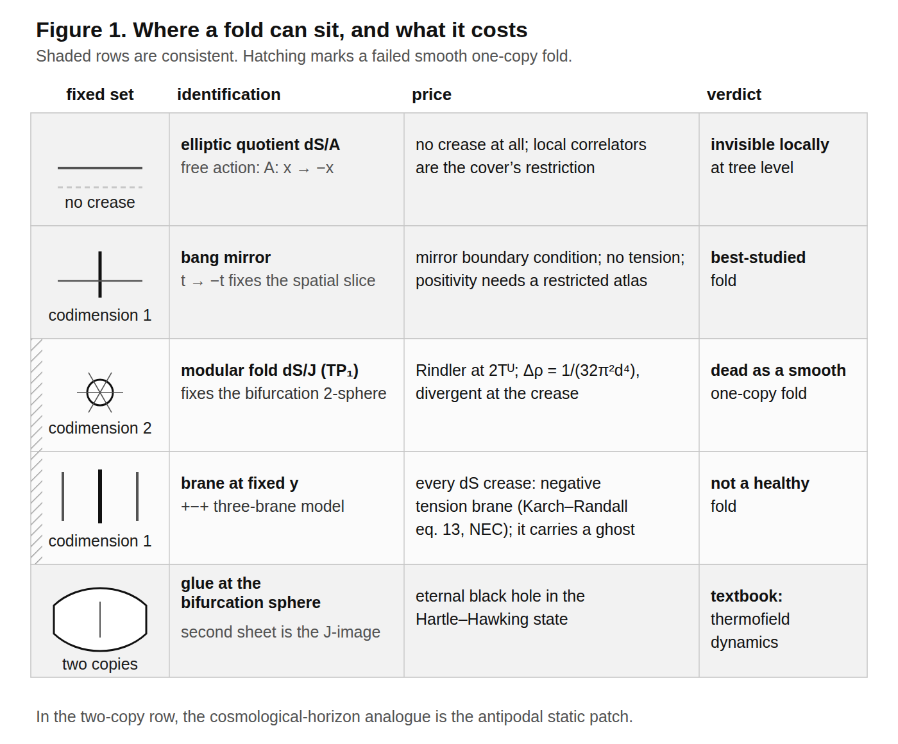
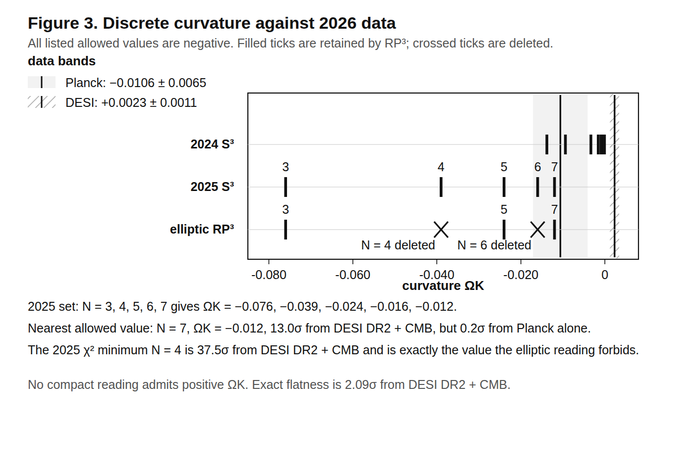

# Supplement to *The Far Side of the Horizon*, V3

This document preserves calculations that are not load-bearing for the six-section
main argument. Each subsection states its own assumptions. Moving a calculation
here does not promote it to a result of the Lorentzian two-copy construction.

The programme-comparison section from V2 is retained only in the frozen working
record and is not part of this submission.

## S1. Bilocal noise and the non-traversable bridge reading

In the demonstrated free two-patch sector, the partner correlation has a
thermofield interpretation. The present implementation adds no interaction
that makes the two exteriors traversable. Equality with the ordinary
restricted state uses the local premises stated in main §2.3. On the central
worldline, the conformal-scalar image kernel equals the half-KMS-period
cross-leg kernel; away from it the transverse antipode must also be retained.
No general interacting-horizon or evaporation result follows from this
dictionary.

A normalized bilocal scalar-probe toy makes the noise split explicit. Let

$$
F_{\rm even}=\frac{F_1+F_2}{\sqrt2},\qquad
F_{\rm odd}=\frac{F_1-F_2}{\sqrt2}.
$$

On the central comoving worldline in the conformal Bunch-Davies state, with
the image frame carried by the antipode,

$$
N_I(t)=-N_0(t-i\beta/2),\qquad \beta=\frac{2\pi}{H}.
$$

The integrated coefficients are $A_0=H^3/(12\pi^2)$ and
$A_I=-H^3/(12\pi^2)$. Thus the normalized even port has zero integrated
noise and the odd port has $H^3/(6\pi^2)$. Their spectra are

$$
S_{\rm even}=\frac{\omega(\omega^2+H^2)}{12\pi}
\tanh\!\left(\frac{\pi\omega}{2H}\right),\qquad
S_{\rm odd}=\frac{\omega(\omega^2+H^2)}{12\pi}
\coth\!\left(\frac{\pi\omega}{2H}\right),
$$

Equivalently,
$S_{\rm even}=\rho(1-2n_F)$ and
$S_{\rm odd}=\rho(1+2n_B)$ at temperature $H/\pi$. At
$\omega=H$ and $H/2$, the even port lies 8.285% and 34.421% below the
vacuum, while the odd port lies 9.033% and 52.487% above it. The main text's
average/difference variables have a different normalization:
$F_c=F_{\rm even}/\sqrt2$ and $F_q=\sqrt2F_{\rm odd}$, so their spectra gain
factors $1/2$ and $2$.

This is a reading of a postulated bilocal probe, not a prediction. The action
contains no worldline-to-image coupling, and the central-worldline KMS identity
does not extend to an assertion that the full antipode is only a time shift.

## S2. The RP3 topology comparison

Three things. *(i)* Nothing to the existence of the branches or their decoherence, which is standard
quantum cosmology. *(ii)* Identifying the contracting branch with the CPT image of the expanding one
is a further assumption, strictly stronger than reality of Ψ, and the condition is named.
*(iii)* One number: RP³ deletes the even-*n* harmonics and *n* = 2 alone supplies 76% of the
exponent. The specified $RP^3$ restriction raises $A_{dec}$ from 1.954 to 2.595, a 32.84% change, while the corresponding proper time $Ht$ rises from 1.290 to 1.608, a 24.63% change; the folded
saddle is tree-level degenerate with the no-boundary cap, the difference being one loop.

**Falsifiable content of the clock comparison: none.** Exactly one harmonic (*n* = 2 on the cover, *n* = 3 on RP³)
leaves the horizon before the tick, and even at $|\Omega_K|=0.005$ its wavelength is seven times the
diameter of the observable universe. The pre-tick modes are super-horizon. If
the $RP^3$ spatial quotient were adopted separately, it would instead face the
standard cosmic-topology search, detectable only for Ω_tot > 1.166. The
defended Lorentzian cover does not acquire this topology from the antilinear
field relation alone.

At the free level, 115 of
the Standard Model's 118 degrees of freedom are conformal on the closed background and contribute
exactly nothing to branch decoherence at the free level (interactions break conformal invariance
through the running couplings, an uncomputed correction of order the β-functions); the tensor tower has *n* ≥ 3 with multiplicity 2($n^2$ − 4), so
the graviton is not two scalar towers. The mass dependence is exact: $A_{dec}$(*m*/*H*) = 1.954, 1.960,
2.011, 2.997, ∞, 3.291 at *m*/*H* = 0, 0.1, 0.3, 1, √2, 3; a minimally coupled scalar of mass² = 2$H^2$
is the conformal scalar and makes no arrow at all. At large $A$, the massless-field decoherence law approaches
$-\log|D|\simeq (N_{\mathrm{eff}}/18)\mathcal N_H$, where
$\mathcal N_H=(3\pi/2)(aH)^3$ is the number of Hubble volumes in a closed $S^3$; this asymptote is not exact near the throat or at the first $e^{-1}$ crossing. The mass-dependent
coefficient is (π/48)($m^2$/$H^2$ − 2)² below *m* = √2*H*.

---

## S3. Euclidean boundary conditions and the CP cost

This comparison imposes additional CP-sector and Euclidean boundary conditions.
Neither follows from the defended Lorentzian cover.

That a bang mirror forbids the $\theta G\widetilde G$ term, solving strong CP without an axion, is Boyle, Teuscher and Turok's [58]; the *other* leg costs the same. The Standard Model on the unorientable Euclidean section with a Pin⁺
structure requires the single reflection to be a symmetry of the *Lagrangian*, not of the spectrum
alone, so CP violation must be spontaneous; García-Etxebarria and Montero, verbatim: *"This theory
would then make sense in unorientable spacetimes, as long as these admit fermions"* [57], their §3.4,
which also establishes $\Omega_5^{\mathrm{Pin}^+}(BG_{\mathrm{SM}})=0$; CP as a discrete gauge symmetry on a nonorientable
spacetime is Choi, Kaplan and Nelson's [75]. The required sector is generic; vector-like quarks
at 1.2 to tens of TeV, θ̄ near the present neutron-EDM limit in the maximal corners [76]; so
n2EDM and nEDM@SNS test it.

The two legs then differ in a checkable way, and this is new. On the bang mirror a CT-odd CP scalar
obeys φ(−*t*) = −φ(*t*), so φ(0) = 0: the wall *is* the bang, nothing in our sky. On the elliptic leg
φ(*Ax*) = −φ(*x*) makes φ odd on the late-time $S^3$, and Borsuk–Ulam forces an antipodally symmetric
zero set separating every point from its antipode, so the imposed elliptic and CT-odd conditions force one
cosmological-scale CP wall even if CP breaking precedes inflation. Its cost: the wall is harmless only for
$\Lambda_{\mathrm{CP}}<\Lambda_*=(\rho_cR_H)^{1/3}=29.5\ \mathrm{MeV}$; the Zel'dovich–Kobzarev–Okun bound [69], recovered
(§S11.10), and otherwise must sit $(\Lambda_{\mathrm{CP}}/\Lambda_*)^3$ Hubble radii beyond the horizon, which inflation
must supply as

> $$
> \Delta N=3\ln\!\left(\frac{\Lambda_{\mathrm{CP}}}{29.5\ \mathrm{MeV}}\right)
> \quad\text{extra e-folds},
> $$

giving 10.6 at 1 GeV, 31.3 at 10³ GeV and 65.8 at 10⁸ GeV.

An elliptic fold with a Nelson–Barr scalar at 10⁸ GeV therefore needs ≳ 126 e-folds of inflation: a
bound on inflation, not on CP physics. The CT-odd assumption, the generic wall position
and the neglect of the wall's repulsive gravity are stated there. Nor is the price free: gauged, spontaneously broken CP
has a domain-wall problem [59], though no global anomaly [60].

## S4. CPT-regular modes and complexity

The bang of the two-sheeted radiation-plus-Λ solution [25] is an isotropic singularity in Goode and Wainwright's sense [18–23] (the authors cite it [24]). What is added is a
positive-definite invariant. Built from the electric and magnetic parts of the Weyl tensor in the
manner of Senovilla [28] and of Clifton, Ellis and Tavakol [29], the complexity 𝒫 vanishes at the
bang like η² for the CPT-regular modes and diverges like |η|⁻¹ for the irregular ones: **the bang is
a complexity minimum with the CPT condition and a maximum without it** (Figure 2; exponents +1.9999989,
+1.9999975 against −0.999994, −1.000000; §S11.9 and the companion calculations). Two legs of Barbour, Koslowski and
Mercati's Janus-point structure [30–32], still Newtonian in 2026 [33], transfer exactly at linear order. The third leg, *D* = 0, fails, so the full identification remains an analogy,
and we found no cross-citation between the two literatures.

## S5. A discrete-curvature mechanism under test

*Whose claim this is.* What follows tests a proposal of Deng and Handley's, not a prediction of this
framework. Nothing here requires quantised curvature. The elliptic reading halves their allowed set and
the data then close what is left, and that is recorded because closing a line is worth more than leaving
it open. A reader who wants only this paper's own commitments can use the commitments table in main §5.5.

Deng and Handley impose CPT at the future conformal boundary as well as at the bang, which restricts
the allowed modes; in a closed universe the wavevectors are already integers, and matching the two
ladders quantises the curvature [36], building on Lasenby, Handley, Bartlett and Negreanu [55]. Their
2025 refit with matter and a Boltzmann hierarchy against a filtered Planck chain [37] gives
$\Omega_K\simeq-0.61/N^2$ for *N* = 3…7 as an asymptotic rule, accumulating at flatness; it matches their table from *N* = 5 up and misses the *N* = 3 entry by 12%; we reproduce it to 0–4%, and obtain a
closed form for their 2024 matching integral, checked against quadrature to 2.4 × 10⁻¹⁶
(§S11.7).

**The elliptic reading halves the set.** Degree-ℓ scalar harmonics on $S^3$ carry antipodal eigenvalue
(−1)^ℓ, so RP³ keeps ν = ℓ+1 odd, while the periodic ladder runs over *N*, 2*N*, 3*N*, …; if *N* were
even the intersection would be empty, leaving no perturbations at all. Hence *N* is odd, deleting *N* = 4, the member their own χ² prefers. (This *N* is Deng and Handley's mode-ladder integer and is unrelated to the equation-of-state ladder's *N* in §S11.8, which is also required odd, for a different reason.)

**The confrontation.** Deng and Handley compare to Planck alone and defer a joint analysis, so this
comparison is ours. Against DESI DR2 BAO plus CMB, $\Omega_K=+0.0023\pm0.0011$ [38];
against Planck 2018 alone, −0.0106 ± 0.0065 [39]; our own refit of the DESI DR2 points with
compressed Planck priors reproduces the first, +0.00275 ± 0.00106 (2.55σ).

| *N* | $\Omega_K$ | vs Planck alone | vs DESI DR2 + CMB | in RP³? |
|---|---|---|---|---|
| 3 | −0.076 | 10.1σ | 71.2σ | kept |
| **4** | **−0.039** | 4.4σ | **37.5σ** | **deleted** |
| 5 | −0.024 | 2.1σ | 23.9σ | kept |
| 6 | −0.016 | 0.8σ | 16.6σ | deleted |
| 7 | −0.012 | **0.22σ** | **13.0σ** | kept |
| ∞ | 0⁻ | 1.6σ | 2.09σ | limit, never attained |

Figure 3 plots the set against both datasets.

Their preferred *N* = 4 model, run against DESI DR2 with every calibration input profiled out so
that only the *shape* of the distance–redshift relation is tested, gives Δχ² = +221 on twelve shape
degrees of freedom; its $H_0$ = 55.0 is 15.6σ from SH0ES against 5.2σ for flat ΛCDM. **And no reading can produce a positive $\Omega_K$**: $\Omega_K=-3\widetilde\kappa\sqrt{\Omega_\Lambda\Omega_r}$, and $\widetilde\kappa>0$ by construction. The
integer condition exists only for compact spherical sections, and RP³ is also a spherical space
form.
Even exact flatness is 2.09σ from the data. Two caveats against us. The Planck-alone column summarises a strongly non-Gaussian posterior, so
Planck alone genuinely prefers −0.039 over flatness. The sparse branch might be thought inadmissible for deleting most primordial modes, but their 2025 paper answers this. The cheapest
decisive test is to re-run their filtered-chain χ² at mode spacing 2*N* with *N* odd inside the
existing quantised-power-spectrum pipeline [53–54]; that needs their modified CLASS and is not done
here.

## S6. A primordial-tilt mechanism under test

*Whose claim this is.* The tilt formula below is Turok and Boyle's and contains nothing from the fold.
The tension the table reports is with their mechanism. The separately adopted BFT production and
mass-sector commitments do not go through it.

Turok and Boyle derive a primordial spectrum from dimension-zero scalar fields and obtain a tilt with
no free parameters, subject to two stated theoretical assumptions [40]. We reproduce the derivation
exactly; the eq. 13 prefactor 3²5³/(7(2π)⁴) = 0.103118125 to eight decimals, and

> **$n_s=1-7\alpha_3(M_P)/\pi=0.957888$.**

Four things fix it: the QCD coefficient $11-2n_f/3=7$; $\alpha_3(M_P)=0.0189$ [41]; the assumption
*p* = 2, which the authors flag; and constancy of $n_s$ across 63.5 e-folds, which is load-bearing,
since a running $\alpha_3$ reaches its Landau pole 47.5 e-folds below $M_{P}$.

| dataset | $n_s$ | $(n_s-0.957888)/\sigma$ |
|---|---|---|
| Planck 2018 TT,TE,EE+lowE+lensing | 0.9649 ± 0.0042 | 1.67σ |
| ACT DR6 alone | 0.9666 ± 0.0077 | 1.13σ |
| SPT-3G D1 alone | 0.9510 ± 0.0110 | −0.63σ |
| P-ACT | 0.9709 ± 0.0038 | 3.42σ |
| CMB-SPA | 0.9679 ± 0.0033 | 3.03σ |
| **P-ACT-LB** | **0.9743 ± 0.0034** | **4.83σ** |
| P-ACT-LB2 | 0.9752 ± 0.0030 | 5.77σ |
| CMB-SPA + DESI DR2 | 0.9726 ± 0.0028 | 5.25σ |

Figure 4 plots the displacements.

[39,42–43,50]. This is posterior tension, not formal exclusion: these are displacements between a
fixed prediction and marginal posteriors in base ΛCDM, not a likelihood ratio for a nested model.
This specified comparison uses base ΛCDM; the fold construction alone does not derive universal values of $N_{\mathrm{eff}}$ or the running.
Freeing $N_{\mathrm{eff}}$ removes the tension entirely, but the value needed is Δ$N_{\mathrm{eff}}$ ≈ −0.35 to −0.82,
*less* radiation than the Standard Model, which the dimension-zero scalars do not supply [51]. The mechanism is also over-constrained internally: requiring the measured amplitude at $N_0=36$
with Standard-Model couplings forces $n_s$ = 0.9498, 7.2σ on the other side of P-ACT-LB. As a
two-observable predictor it does not survive; as a one-observable fit it survives and predicts
nothing.

**Mechanism, not structure.** Nothing in the CPT-symmetric structure, and nothing in the fold, enters
the tilt formula: it is built from the high-temperature trace anomaly, the QCD β-function and an
assumption about which factor of α carries the scale dependence, as the authors say in their own
conclusion. The tension concerns this tilt mechanism. It does not change the separately adopted BFT
production calculation, its primordial-tensor commitment or the massless-neutrino consequence of
exact stabilisation. The 4.8 × 10⁸ GeV abundance-calibrated mass is likewise unaffected. We record that the dimension-zero
scalars are under independent theoretical dispute [44], unanswered at the time of writing, and we
found no second live test. Early-galaxy abundances require an explicit initial-condition,
growth and astrophysical model before they can test the specified cosmological implementation
[45–48].

---

## S7. A future-horizon low-quadrupole conjecture

The tensor response of §S9 has no scale at the bang. For the fixed Planck-like expansion history and
observer epoch used here, the remaining conformal distance from today is
$\eta_f=\int_1^\infty da/(a^2H)=1.14965\,c/H_0=5.114$ Gpc. Its inverse is
$k_c=1/\eta_f=1.96\times10^{-4}\ \mathrm{Mpc}^{-1}$, near the quadrupole scale. As a conditional
scalar-spectrum shape test, choose
$S(k)=(k\eta_f)^4/[1+(k\eta_f)^4]$; neither this scalar multiplier nor its future-boundary origin is
derived. A simplified Sachs–Wolfe plus late integrated-Sachs–Wolfe calculation gives TT ratios 0.734,
0.862, 0.936 and 0.969 at ℓ = 2–5, and 0.998 at ℓ = 10. The EE response has not been calculated.
Applied to the published Planck 2018 spectrum estimates [39], an idealised independent full-sky
cosmic-variance proxy gives $\Delta(-2\ln L)=-1.030$ and quadrupole lower-tail probabilities 0.0469
and 0.0884. These are not an evaluation of the official Planck likelihood. The chosen shape would
not account for the whole deficit, and it leaves the ℓ ≈ 20–30 dip untouched.

The radiation–Λ Baker–Akhiezer mode with its specified global sheet choice fails a global
remaining-distance-only law. The follow-up script propagates its fold data and samples its absolute
power; it does not construct the independent cap-local reference proposed in the earlier calculation.
Its reported 78%, 62% and 24% spreads used ±12% bins around nominal *q*. Comparisons matched exactly
at $q=0.3,0.6,1.0$ also fail to collapse, with spreads 66.6%, 64.8% and 23.0% on the six-κ audit grid.
Here $q=\kappa(T-x)$ measures conformal event-horizon distance; $q\simeq k/(aH)$ only near the cap.
The late normalised tensor power is $F=\kappa^2/\sqrt{1+\kappa^4}$, while the chosen scalar multiplier
uses its square. A physical scalar or final-state mechanism and the cap-local-reference calculation
remain unestablished. In a universe with matter, the corresponding transition is the matter–Λ
crossover, whose conformal scale is of order the horizon today; the crease law has not been
recomputed on that background here.

## S8. Restricted exact-$\Lambda$ analysis

This calculation supports the exact-$\Lambda$ baseline only within a stated
metric-only action class. Let $K$ be the expansion scalar and
$s=\log(K_c/K)$. The added action contribution is

$$
S_{\rm add}=\int dt\,d^3x\,N\sqrt h\,f(K),
\qquad f(K)=-\rho_c W(s).
$$

Its homogeneous energy density is $\rho_c(W+W_s)$, not $\rho_cW$.
For arbitrary spatial lapse smearings, the exact shear-retaining Hamiltonian
bracket contains

$$
\{H[N],H[M]\}=H_i[\cdots]
-\int d^3x\,\sqrt h\,\rho_c
\frac{W_s+W_{ss}}{K^2}
(N D^iM-MD^iN)D_iK .
$$

Requiring off-shell closure for this full class of refoliations gives
$W_s+W_{ss}=0$, hence

$$
W(s)=W_0+C e^{-s}.
$$

Because $e^{-s}=K/K_c$, the second term contributes to the action in proportion to
$\int dt\,d^3x\,N\sqrt h\,K$ and is a time-boundary term, up to spatial
boundary terms. The surviving bulk term is
constant. For a homogeneous metric-only Lagrangian $a^3f(\theta)$, with
$\theta=3H$,

$$
\rho=\theta f'(\theta)-f(\theta),\qquad
\rho+p=-\dot\theta f''(\theta).
$$

The constant term therefore has $p_\Lambda=-\rho_\Lambda$ even in a
matter-filled decelerating universe. With separate conservation, $Q=0$ and
$\rho_m\propto a^{-3}$.

The scope matters. Spatially constant lapse smearings or a constant-mean-
curvature slice make the displayed anomalous term vanish for any $W$.
Whether a reduced TDiff or unimodular completion requires the full lapse class
is a separate constraint problem. The result above is therefore a restricted
off-shell closure result, not a theorem about every covariant dark-energy
theory.

## S9. Tensor crease calculation

On the exactly solvable radiation–Λ background,
$y_x^2=1+y^4$ in conformal time $x$ (units of the radiation–Λ crossover time $\eta_*$), the tensor mode
equation is the $n=1$ Lamé system $u''+(\kappa^2-2y^2)u=0$, $\kappa=k\eta_*$, and the solution selected by
its future frozen branch (a Baker–Akhiezer condition: a condition at the cap, not at the crease) has
fold impedance $\Omega^2=z+z^{-1}$, $z=\kappa^2$, and late normalised tensor power
$F=z/\sqrt{1+z^2}$ (reproduced by direct Wronskian-normalised integration). Its square is one logistic
variable read several ways: with $s=\log z$, $F^2=\sigma(2s)$, the associated response crossover is
$\tanh s$, and the Fisher information is $\operatorname{sech}^2s$; on the
lemniscatic curve $j=1728$ that the background itself is, that Fisher information is a regular
degree-eight Belyi map, $64/u^4$ in the quotient coordinate $u=p/z$, verified independently. It is exact and it is structure: at the observed $\Lambda$ the amplitude it multiplies is
$2H_\Lambda^2/(\pi^2M_{\rm Pl}^2)\simeq5\times10^{-122}$ and the crossover $k_c=\eta_*^{-1}=2\times10^{-5}\ \mathrm{Mpc}^{-1}$ lies beyond the horizon,
so nothing observable follows from it at the bang crease, and the selection of the sheet is a
condition the action does not yet supply. The displayed tensor shape follows from the stated
background and future-branch condition. The action does not select that condition, and no
observed-scale realization is derived here.

## S10. Detailed information-criterion and laboratory comparisons

The following accounting is supplementary. Information criteria organize tradeoffs but do not decide physical truth.

A word first about what the numbers below mean, because the reasoning behind them is more intuitive than
the notation suggests.

Give a model enough adjustable numbers and it will fit anything. A curve with ten free coefficients can be
made to pass through any ten points, exactly, every time; and the fact that it does tells you nothing
about the world. So agreement with data is never impressive by itself. What is impressive is agreement
bought cheaply, with few adjustments. Information criteria put a price on each adjustment and ask whether
the improvement in fit was worth what it cost.

There are two prices in common use and they answer different questions. Akaike's criterion asks whether
the model will predict the *next* measurement well, and charges 2 for each free parameter. Schwarz's,
usually written BIC, asks whether a parameter is *real* or is merely soaking up noise, and charges ln *n*
for each one, where *n* is the number of data points; with about 1600 points that is a rent of roughly
7.4 per parameter rather than 2. In both, a negative number favours the model being tested and a positive
number favours the simpler alternative it is being tested against.

Against ΛCDM with a free neutrino mass sum, the adopted exact-stabilisation BFT sector fixes the sum
from oscillation inputs once normal ordering is chosen. The absolute-mass likelihood below does not
fit that value. This comparison concerns the restricted cosmological submodel; it does not isolate
observational evidence for the geometric fold.

A parameter accounting, since "minimal" is a claim about parameters. Against ΛCDM with $\Sigma m_\nu$ free,
that sector fixes $\Sigma m_\nu$ at 58.8 meV and pays Δχ² = +3.0 on the geometry-only likelihood summarized in main §5.6
(1580 Pantheon+ supernovae with their full covariance, 13 DESI DR2 BAO points, two compressed Planck
priors), while $w_0w_a$CDM gains Δχ² = −9.1 for two more parameters. With
the Akaike penalty of 2 per parameter this is ΔAIC = +1.0 for the mass-restricted submodel against ΛCDM and −5.1
for $w_0w_a$CDM: a tie and a loss. With the Schwarz penalty ln *n* = 7.4 per parameter, the
criterion that asks whether a parameter is real, not whether it helps prediction, the order
reverses: ΔBIC = −4.4 for the mass-restricted submodel against ΛCDM and +5.6 for $w_0w_a$CDM, so on this
likelihood the submodel is preferred over both. Two caveats travel with the second number. The supernova points are
correlated, so ln *n* overstates the penalty by a factor the effective sample size would reduce,
moving the result toward the AIC end; and the CMB-inclusive likelihoods are harder on both sides.
With DESI+CMB, fixing $\Sigma m_\nu$ at the oscillation floor costs Δχ² = 7.2 [35], so the submodel's
ΔAIC against ΛCDM is +5.2 and BIC prefers it only if the effective number of independent data
points exceeds 1300; and $w_0w_a$CDM gains Δχ² = −10.7 to −21.0 depending on the supernova sample
[38], which BIC rewards only if that number is below 210 (Pantheon+) to 36,000 (DESY5). Since a
CMB-inclusive likelihood has no simple count of independent points, those break-even values are
reported rather than a verdict. The reference varies neither *r* nor *w*, so the adopted cosmology's *r* = 0 and Λ earn
nothing here; against models that vary them it earns more. The Turok–Boyle tilt mechanism, which
would fix $n_s$ as well, costs Δχ² = 23 against the P-ACT-LB tilt of §S6 and loses under either
penalty; the structure does not carry it.

## S11. Supporting calculations for supplementary mechanisms

These calculations support optional comparisons and are not premises of the six-section main argument.

**S11.1 Where a crease can sit, and what each position costs.** The classification is placed here because main §3 carries the adjudication instead. Which fold one takes
is fixed by the fixed-point set of the involution; the crease; and Figure 1 is the table.

| position | involution | fixed set | what it costs | verdict |
|---|---|---|---|---|
| no crease | elliptic *A* on dS | empty (free) | nothing locally, under stated premises | conditionally silent (main Appendix A.2) |
| codim 1, spacelike | *t* → −*t* | the whole spatial slice | a mirror boundary condition; no tension | the best-studied fold |
| codim 2 | modular *J* | the bifurcation 2-sphere | the quotient-respecting state is Rindler at 2$T_{U}$ | dead as a smooth one-copy fold |
| codim 1, timelike | reflection in a bulk coordinate | a brane worldvolume | negative tension, and a ghost | not a healthy fold |
| two copies | antilinear pairing on the cover; $\alpha=J\circ P_\perp$ in the stated de Sitter construction | none | standard closed-time-path algebra with a specified global twist | compatible with the demonstrated physical free-graviton sector in main §2 |

**S11.2 The two involutions.** Sewell's theorem gives the modular reflection of a wedge as
(*t*,*w*;**y**) → (−*t*,−*w*;**y**) [7]; Borchers and Buchholz specialise it to de Sitter, where the
reflection reverses $X_0$ and $X_1$ and fixes the transverse coordinates [8]. The antipode reverses all
five. Hence *A* = *J* ∘ P⊥ with P⊥ acting on harmonics as $(-1)^\ell$. The elliptic interpretation is
Schrödinger's [1]; Gibbons applied it to black holes [2]; Folacci and Sánchez computed the elliptic
scalar field theory [6]; Parikh, Savonije and Verlinde gave dS/Z₂ its modern form [3]; 't Hooft made
the antipodal identification the centre of a black-hole S-matrix proposal [4–5].

**S11.3 The codimension classification.** Codimension one, timelike: in a de Sitter-sliced warp
respecting the null energy condition, Karch and Randall's inequality forces the crease tension
negative [13], and in the three-brane realisation of Kogan et al. [14] the crease carries the model's
ghost. These obstructions apply to the stated warped and three-brane constructions; higher-codimension de Sitter branes have separate no-go results [52]. Codimension one, spacelike: a time mirror has no tension.
Codimension two: the fixed set is the bifurcation sphere.

**S11.4 The 2$T_{U}$ crease state.** The state respecting a codimension-two identification is the even
Euclidean scalar on the π-angle Z₂ cone, whose Green function is π-periodic, giving
Δ⟨φ²⟩ = 1/(16π²$r^2$) and Δρ = 1/(32π²$r^4$); both coefficients are Moretti's [12]. Read Lorentzianly, the
crease state is the Rindler thermal state at *twice* the Unruh temperature, so it is non-integrable
at the horizon: singular exactly where it is a fold. Two independent checks: the conical formula
⟨φ²⟩ = ($N^2$−1)/(48π²$r^2$) [56] at *N* = 2, and the Rindler thermal density
ρ = [(*T*/$T_{U}$)⁴−1]/(480π²$d^4$) at *T* = 2$T_{U}$. Withdrawn in the same place: reading the deficit
angle π as a Lorentzian positive-tension defect; a Euclidean deficit is an SO(2) rotation while the
real Lorentzian action lies in a disconnected component of the Lorentz group.

**S11.5 Why four dimensions.** For the Z₂-odd transverse-traceless graviton of a
$\mathrm{dS}_d$-sliced $\mathrm{AdS}_{d+1}$ bulk,
$(\sinh^d u\,\psi')'+\epsilon\sinh^{d-2}u\,\psi=0$ with
$\psi(L)=0$ at the crease and $\psi'(w_0)=0$ at the
brane, the Higuchi/partially-massless value ε_PM = *d* − 2 [17] is the lowest eigenvalue on the
midpoint line $w_0$ = 2*L* **only in four dimensions**. Two things must line up and only *d* = 4 makes
both happen: the antiderivative $(d-2)\int du/\sinh^{d-2}u$ must be degree one in
$\coth u$ (true at *d* = 4 alone), and the boundary term
$1/(\sinh^{d-3}L\cosh L)$ must be a sinh of the doubled
position, which it is (2/sinh 2*L*) only at *d* = 4. The condition collapses to
2 sinh *X* cosh *Y* = sinh(*X*+*Y*) − sinh(*X*−*Y*) = 2 cosh *X* sinh *Y*, so tanh *X* = tanh *Y*, i.e. sinh($w_0$ − 2*L*) = 0. Numerically $\epsilon_1$ at
*L* = 0.5, 1, 2 on the midpoint line is 2.00000 three times at *d* = 4, against 2.998/3.631/6.977 at
*d* = 3, 1.291/1.033/0.480 at *d* = 5 and 0.806/0.502/0.102 at *d* = 6. The model in which this
happens has a ghost at that point, so it is a fact about a sick model and no observability claim is attached.

**S11.6 The RP⁴ one-loop invariant.** Conformal Laplacian *L* = −∇² + 2 at unit radius; eigenvalues
λ_ℓ = (ℓ+1)(ℓ+2) with degeneracy (ℓ+1)(ℓ+2)(2ℓ+3)/6; the antipodal map acts as $(-1)^\ell$.
*F* = −½ζ′(0) − ζ(0)ln μ*R*; the two parities' zeta functions add to the sphere's term by term, so
Δ*F*₊ + Δ*F*₋ = 0, and ζ(0) = −χ/180 in all three cases. Closed forms:
ζ′_{S⁴}(0) = 1/144 + ζ′(−1)/3 + 2ζ′(−3)/3 and ζ′₊(0) − ζ′₋(0) = 7ζ(3)/(4π²). The reference value is
*F*_{S⁴} = −1/288 − ζ′(−1)/6 − ζ′(−3)/3 + (1/90)ln μ*R*, its log coefficient checked against [49].
*Why no counterterm absorbs it:* every counterterm in the four-dimensional gravitational effective
action is the integral of a local curvature scalar, and RP⁴ is locally isometric to $S^4$ with
exactly half its volume, so each contributes exactly half its $S^4$ value; Gauss–Bonnet included,
since χ goes 2 → 1; and all of that sits inside ½*F*_{S⁴} and cancels in the difference. Seven numerical routes check these fixed spectral identities,
with $S^2$ and $S^3$ controls. Their high-precision agreement concerns the calculation, not the accuracy of a physical prediction.

**S11.7 The discrete-curvature reproduction.** The 2024 background is $\dot a^2=(\lambda/3)(a^4-2\widetilde\kappa a^2+1)$, with
$\widetilde\kappa=3\kappa/(2\lambda)$ and matching $G(\widetilde\kappa)=\sqrt{2\widetilde\kappa/3}\,I(\widetilde\kappa)=N\pi/2$ or $\pi/(2N)$; the closed form is
$I(\widetilde\kappa)=\pi/[2\operatorname{agm}(1,\sqrt{(1-\widetilde\kappa)/2})]$, with $I(0)=\Gamma(1/4)^2/(4\sqrt\pi)=1.854074677301$ and $I(-1)=\pi/2$.
Conversion $\Omega_K=-2\widetilde\kappa\sqrt{\Omega_\Lambda\Omega_r}$; the difference between the two 2024 arXiv versions is entirely in
that coefficient. The 2025 background has four components, $\widetilde\kappa_{25}=(2/3)\widetilde\kappa_{24}$ and matter $\rho_m\propto |a|^{-3}$, so the
background stays symmetric across the bang, conversion $\Omega_K=-3\widetilde\kappa_{25}\sqrt{\Omega_\Lambda\Omega_r}$; the matching tightens
from *n*π/2 to *n*π, and the two calibrations differ by 2/√3, decomposing as ×2 from symmetric-only
modes and ×1/√3 because the 2024 phase is acoustic and the 2025 phase free-streaming. The matter-free
limit of the 2025 integral reproduces the 2024 closed form to 4.4 × 10⁻¹⁶.

**S11.8 Three items deferred.** *(i)* Barbour's own proposed general-relativistic complexity, the
Yamabe invariant [32], does **not** detect the bang: it depends only on the conformal 3-geometry,
which is frozen there; over the super-horizon window the comoving curvature perturbation varies by
2.2 × 10⁻³ while 𝒫 changes by factors of 10³–10⁶. *(ii)* The linear ceiling: exactly, in the radiation
era, $\mathcal P_S=3\sqrt2\,\Phi_i|xj_1(x)|$, maximum $4.5104\,\Phi_i$ at $x=2.7437$, so at the measured amplitude
$\Phi_i\simeq2\times10^{-5}$ the complexity is capped at about $10^{-4}$; Barbour's unbounded growth is nonlinear and
invisible here. *(iii)* The equation-of-state ladder: with
$\rho_w\propto a^{-(2N+2)/N}$, the CPT-allowed
rungs are *N* = 3 ($w=-1/9$, $\rho\propto a^{-8/3}$),
*N* = 5 ($w=-1/5$, $\rho\propto a^{-12/5}$) and *N* = −1
(a cosmological constant); every rung is shallower than *a*⁻⁴.

**S11.9 The Bel–Robinson complexity.** With $E$ and $B$ the electric and magnetic parts of the Weyl
tensor and observer $u=a^{-1}\partial_\eta$,
$$
\mathcal P=\left[
\frac{8\langle E_{ab}E^{ab}+B_{ab}B^{ab}\rangle}
{(R_{ab}R^{ab})_0}
\right]^{1/2},
$$
normalised by $R_{ab}R^{ab}$ because the Ricci scalar is the exact constant $4\lambda$ for radiation plus $\Lambda$.
The CPT condition on the tetrad [26] says in conformal-Newtonian gauge exactly that the Bardeen
potential is **even**, so regularity at the bang and evenness are the same condition; the background
is conformally flat, so the first-order Weyl tensor is gauge-invariant by Stewart and Walker [27].
The regular modes give $\mathcal P_S=(\sqrt2/3)k^2|\Phi_i|\eta^2$ and
$\mathcal P_T=\sqrt{8/27}\,k^2|h_i|\eta^2$, exactly even on both
sheets and vanishing at the bang from either side; the irregular Bardeen solution is
$\sim\eta^{-3}$ and the irregular tensor mode is $\sim\eta^{-1}$, so both give
$\mathcal P\propto|\eta|^{-1}$. The two Barbour legs that transfer are
$E_{\mathrm{tot}}=0\leftrightarrow\kappa=0$ (an identity: $\kappa$ is minus the total energy per unit mass) and $L_{\mathrm{tot}}=0$, which corresponds to
vanishing primordial vorticity and is *derived*; the gauge-invariant vector perturbation obeys
$\sigma_g'+2\mathcal H\sigma_g=0$, so $\sigma_g\propto\tau_-^2$ is even, while $\sigma_g$ is also the derivative of an even tensor mode and
hence odd, forcing the coefficient to vanish. The leg that fails is *D* = 0: d($a^2$)/d*t* → 2√(*r*/3)
at the bang, a non-zero constant.

**S11.10 The CP-wall threshold and its e-fold cost.** Supplement §S3's 29.5 MeV and $\Delta N$, derived. A wall of
energy per unit area $\sigma=\Lambda_{\mathrm{CP}}^3$ crossing our Hubble volume contributes $\rho_{\mathrm{wall}}\sim\sigma/R_H$, and is
harmless only if that is far below the critical density:

> $$
> \sigma=\Lambda_{\mathrm{CP}}^3,\qquad
> \rho_{\mathrm{wall}}\sim\frac{\sigma}{R_H}\ll\rho_c
> \Longleftrightarrow
> \Lambda_{\mathrm{CP}}<(\rho_cR_H)^{1/3}.
> $$
> The inputs are $H_0=67.4\ \mathrm{km\,s^{-1}\,Mpc^{-1}}$,
> $c=2.99792458\times10^8\ \mathrm{m\,s^{-1}}$,
> $G=6.674\times10^{-11}$ SI, $\rho_c=3H_0^2/(8\pi G)$ and $R_H=c/H_0$,
> with $1\ \mathrm{Mpc}=3.0857\times10^{22}\ \mathrm m$,
> $\hbar c=1.9733\times10^{-16}\ \mathrm{GeV\,m}$ and
> $1\ \mathrm{kg}=5.6096\times10^{26}\ \mathrm{GeV}$. Thus
> $$
> \begin{aligned}
> \rho_c&=3.678\times10^{-47}\ \mathrm{GeV}^4,\\
> R_H&=6.955\times10^{41}\ \mathrm{GeV}^{-1},\\
> (\rho_cR_H)^{1/3}&=29.5\ \mathrm{MeV}.
> \end{aligned}
> $$
> Above that threshold the wall must sit at
> $$
> \frac{d}{R_H}=\frac{\sigma}{\rho_cR_H}
> =\left(\frac{\Lambda_{\mathrm{CP}}}{29.5\ \mathrm{MeV}}\right)^3,
> \qquad
> \Delta N=3\ln\!\left(\frac{\Lambda_{\mathrm{CP}}}{29.5\ \mathrm{MeV}}\right).
> $$

The threshold is the Zel'dovich–Kobzarev–Okun bound [69], recovered here from the wall required by
§S3's imposed odd CP-field condition, not from a Kibble network, and the e-fold cost is the arithmetic of pushing a
wall of that tension $(\Lambda_{\mathrm{CP}}/29.5\ \mathrm{MeV})^3$ Hubble radii outside the horizon: $d/R_H=3.91\times10^4$ at
$\Lambda_{\mathrm{CP}}=1$ GeV, $3.91\times10^{13}$ at $10^3$ GeV and $3.91\times10^{28}$ at $10^8$ GeV, hence $\Delta N=10.6$, 31.3 and 65.8
beyond the horizon-problem minimum, so that $N_{\mathrm{total}}=125.8$ at $10^8$ GeV against $N_{\min}=60$. Every
step is a statement about inflation and none of it is a statement about CP physics; the caveats stated in Supplement §S3 are the CT-odd assumption, the generic wall position, the neglected
repulsive gravity of the wall, and that the $\Lambda_{\mathrm{CP}}$ values are illustrative, not predicted.

---

## S12. Figures for supplementary mechanisms

**Figure 1: the crease dictionary.** The classification of §S11.1 drawn as a table: fold
position, involution, fixed set, price, verdict.

**Figure 2: the bang as a complexity minimum.** The Bel–Robinson complexity $\mathcal{P}$ of §S4 against
conformal time for the CPT-regular scalar and tensor modes ($\propto \eta^2$, vanishing at the bang from both
sides) and for the irregular modes ($\propto |\eta|^{-1}$), shown for the representative case $k=20$.
The fitted exponents at $k$ = 5, 20, 80 are reported in §S4 and §S11.9.

**Figure 3: the quantised curvature against 2026 data.** Deng and Handley's allowed $\Omega_K$ set for
$N$ = 3…7 [37], with the members the elliptic reading deletes marked, against Planck 2018 alone [39]
and DESI DR2 BAO + CMB [38]. Tensions as tabulated in §S5.

**Figure 4: the primordial tilt against 2026 data.** $n_s$ = 0.957888 from Turok and Boyle's
dimension-zero mechanism [40] against the eight datasets of §S6 [39,42–43,50], each shown with its
displacement in $\sigma$.

## S13. A weak Yukawa decay benchmark

The example in §5.2 retains a fixed rank-two tree-level seesaw from two heavier, nondegenerate sterile neutrinos and adds only the small column $y_\alpha$ of $N_1$. Its free lifetime and flavor direction are not selected by geometry. All formulas below are at leading seesaw and decay order, with $H^0=(v+h+iG^0)/\sqrt2$, $v=246.22$ GeV and $q=y^\dagger y$.

For $r_b=m_b^2/M_1^2$, define $f_V(r)=(1-r)^2(1+2r)$ and $f_h(r)=(1-r)^2$. Averaging over the $N_1$ spin and summing over both light-neutrino helicities in the neutral channels and both charges in the $W\ell$ channel gives [81]

$$
\Gamma_0=\frac{qM_1}{32\pi}\{2f_V(r_W)+f_V(r_Z)+f_h(r_h)\}
\simeq\frac{qM_1}{8\pi}.
$$

These are Born hard-process fractions, not exclusive no-radiation fractions. Inclusive widths receive perturbative corrections, and electroweak showering must be included in an observed spectral calculation [82]. We use $\tau=\hbar/\Gamma_0$ only as a freely chosen leading-order lifetime parameter.

If $u_0$ is a unit null vector of the rank-two mass matrix $m_0$, the added complex symmetric matrix is $\delta m=-v^2yy^T/(2M_1)$, with spectral norm $v^2q/(2M_1)$. The Takagi masses are singular values, so

$$
s_{\min}(m_0+\delta m)\leq\|(m_0+\delta m)u_0\|
\leq\|\delta m\|_2=\frac{4\pi v^2\hbar}{M_1^2\tau}.
$$

Choosing $y=\sqrt q\,u_0^*$ attains this bound while leaving the two nonzero masses unchanged at this order. Choosing $u_0^Ty=0$ leaves a zero at this order. Thus the bound is not a flavor-independent nonzero prediction. Baseline radiative masses, running and matching corrections are outside this tree-level bound.

For $M_1=4.848\times10^8$ GeV and the illustrative $\tau=10^{28}$ s, $q\simeq3.4\times10^{-60}$. In standard radiation domination with $g_*=g_{*s}=106.75$, conserved entropy and no other portal, $H(T=M_1)\simeq0.33$ GeV and $\Gamma_0/H(T=M_1)\simeq2.0\times10^{-52}$. A perturbative relativistic scattering rate $CqT$ obeys $\Gamma_{\rm sc}/H\simeq5.0\times10^{-51}C$ at $T=M_1$ and falls as $1/T$ at higher temperatures. The integrated probability $\int_{T\geq M_1}(\Gamma_{\rm sc}/H)\,d\ln T$ is at most this value for bounded $C$; no ultraviolet power enhancement occurs in this renormalizable interaction.

An inverse-decay abundance check is stronger than nonthermalisation alone. In the Maxwell-Boltzmann approximation with $x=M_1/T$ and $g_N=2$,

$$
\frac{dY}{dx}=\frac{45g_N}{4\pi^4g_{*s}}\frac{\Gamma_0}{H(T=M_1)}x^3K_1(x),
\qquad
Y=\frac{135g_N}{8\pi^3g_{*s}}\frac{\Gamma_0}{H(T=M_1)}\simeq2.0\times10^{-54},
$$

using $\int_0^\infty x^3K_1(x)dx=3\pi/2$. The adopted present density and entropy inputs give $Y_{\rm DM}=\rho_{\rm DM,0}/(s_0M_1)\simeq8.7\times10^{-19}$. Thermal-mass and statistical corrections cannot compensate for this coupling suppression in the stated perturbative bath. For a scattering reaction density $C_{\rm prod}qT^4$, the relativistic yield is of order $10^{-52}C_{\rm prod}$ or smaller. The depletion over 13.8 Gyr is $1-e^{-t_0/\tau}\simeq4.4\times10^{-11}$.

These estimates exhibit an internally consistent, effectively unchanged abundance at the quoted accuracy. They do not construct the interacting BFT initial state or constrain unspecified additional portals. Setting $y=0$ restores the imposed species parity, explaining perturbative stability of a chosen tiny column without selecting its magnitude. If that parity is instead required to be an exact gauged symmetry, the added term needs a separate symmetry-breaking completion. The example assumes a weakly broken matter rule and makes no observational lifetime-bound or KM3NeT event-rate claim.
